# Three Projects, One Goal: Making Split-Flap Displays Easier to Build, Run and Enjoy

If you've ever wanted to build one of those beautiful mechanical split-flap displays you see in train stations and airports, you've probably come across [Adam G Makes](https://www.youtube.com/@AdamGMakes) on YouTube. His [split-flap display project](https://youtu.be/-C8_AtxEEQc?si=Gym5wikeFH2vUNRm) is a masterpiece of DIY engineering — each character cell is a compact, self-contained module built around an ATtiny1616 microcontroller, driven by a stepper motor with a Hall sensor for positioning, and connected to a shared RS-485 bus. The result is a display that looks and sounds exactly like the real thing.

The hardware is excellent. But as the community around this project has grown, three separate limitations have emerged that make the display harder to scale, maintain, and actually *enjoy* than it needs to be. This post is about three independent projects that each tackle one of those limitations — and why all three were built with great care not to break anything that already works.

<a href="screenshots/ecosystem.png">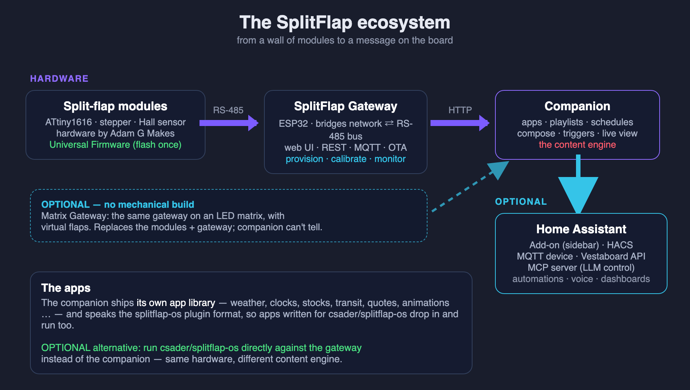</a>  
*The three pieces and how they connect: modules on an RS-485 bus, a gateway that bridges the bus to the network, and a companion that decides what to show.*

> Everything below, and a great deal more, is documented step by step in the **[SplitFlap wiki](https://github.com/avandeputte/SplitFlapGateway/wiki)** — start with the [Quick Start](https://github.com/avandeputte/SplitFlapGateway/wiki/Quick-Start) if you'd rather build than read.

---

## Limitation One: One Firmware Per Module

In Adam's original firmware, each module's bus address — the ID that tells it which RS-485 commands to respond to — is **hardcoded directly into the firmware binary**. Module 1 has a different firmware than module 5, which has a different firmware than module 38. Every single module requires its own edit-compile-and-flash cycle before it can be installed.

For a small display with a handful of modules this is merely tedious. For a larger display with dozens of modules it becomes a genuine logistical burden. Each module must be individually flashed with a customised binary before installation. Swap a module, and you flash again. Rearrange the physical layout, and you're back to the IDE.

### The Solution: Universal Firmware with Runtime Provisioning

The [SplitFlapUniversalFirmware](https://github.com/avandeputte/SplitFlapUniversalFirmware) solves this by eliminating the hardcoded ID entirely. You still flash each module yourself — this is a DIY project after all — but every module runs the **exact same firmware binary**. Flash it once per module, and you're done. Identity is assigned at runtime through provisioning, not at compile time. As a side note, this also means Adam could, if he ever wanted to, sell pre-flashed modules — since the firmware is universal, a module can come straight out of the box, get plugged into the bus, and be provisioned on the spot without anyone ever touching the IDE.

Every ATtiny1616 microcontroller has a factory-programmed, globally unique 10-byte serial number burned into its silicon. The universal firmware reads this at boot and uses it as the module's permanent identity. When a module powers up without an assigned bus ID, it broadcasts its serial number on the RS-485 bus every 10–15 seconds (with randomised intervals to avoid collisions when many modules power on simultaneously).

To claim a module, a host system sends a provisioning command:

```
mXIA3F24C0018E7D29B3F01:38\n
```

This tells the module with that serial number to assign itself bus ID 38, write it to EEPROM, and stop advertising. From that moment on it behaves exactly like any other module on the bus. To physically identify which module corresponds to which serial number before assigning, a home-by-serial command spins only the matching module:

```
mXHA3F24C0018E7D29B3F01\n
```

One binary. Flash once per module, provision once, done.

### It Grew Into More Than an ID

Once every module had a permanent identity, other things became possible that the original firmware couldn't offer:

- **Backup and restore by serial number.** A module's entire calibration can be read out in one command and written back later — to the same module, or to a replacement — because the serial number, not the bus position, is what identifies it.
- **A configurable flap set.** The flap count and the character printed on each flap are stored per module. Print a reel with `É`, `Ö` or `Ñ` on it, or a shorter reel without punctuation, tell the module, and text still lands on the right flap.
- **Built-in self-diagnostics.** A module can report its supply voltage, reset cause and EEPROM health without moving, test its own Hall sensor, and spin its reel several times to detect missed steps — so when a cell misbehaves you can tell power, sensor and motor apart without opening it.
- **Automatic Hall-sensor polarity detection**, a brown-out detector, and a watchdog, so a module that gets into trouble recovers on its own.

### Backward Compatibility Was Non-Negotiable

The universal firmware was built with full backward compatibility as a hard requirement. Every command from Adam's original protocol works exactly as before — the same syntax, the same responses, the same timing. Projects already built on the original firmware continue to work unchanged.

A good example is [splitflap-os](https://github.com/csader/splitflap-os) by csader — a polished web-based control interface with a large library of apps (weather, stocks, sports scores, word clock, news headlines and more), playlists, live preview, calibration tools, and Home Assistant integration via MQTT. It runs on the Raspberry Pi alongside the display and speaks the same RS-485 protocol. The universal firmware adds provisioning commands without touching anything splitflap-os uses — both work together without any modifications, and splitflap-os has since built provisioning into its own UI.

---

## Limitation Two: A Computer Inside the Display

In the original project setup, the RS-485 bus connects directly to a Raspberry Pi that lives physically inside or alongside the display assembly. The Pi is the brains of the operation — it drives the bus, runs whatever software controls the display, and handles all the application logic.

On the surface that sounds fine. In practice it means you have a full Linux computer embedded in your display. That computer needs to be maintained. OS updates, security patches, SSH access, a filesystem that can corrupt if you pull the power at the wrong moment. If something goes wrong with the Pi, your display stops working. For a decorative display you just want to run reliably for years, that's a surprising amount of ongoing responsibility.

### The Solution: A Microcontroller That Does One Job

The [Split-Flap Gateway](https://github.com/avandeputte/SplitFlapGateway) replaces the Raspberry Pi with a single low-cost microcontroller board — the [Waveshare ESP32-S3-RS485-CAN](https://www.amazon.com/dp/B0FNCWZ3D1) — that does exactly one thing: bridge the RS-485 bus to your WiFi network. No operating system to patch. No filesystem to corrupt. The firmware lives in flash memory, boots in under a second, and runs indefinitely without intervention.

The "heavy stuff" — the UI, the automation logic, the integration with other systems — runs somewhere you already own and maintain. Your PC, your NAS, a home automation server. You're not adding a new computer to maintain; you're connecting to infrastructure you already have.

Beyond simply replacing the Raspberry Pi, the gateway opens up integration possibilities that didn't exist before. In the original project the only way to talk to the display is the RS-485 bus protocol — which means anything that wants to control the display needs to be physically wired to the bus and speak that low-level protocol directly. The gateway changes that completely. By bridging the bus to WiFi and exposing it through REST and MQTT, any device on your network — a phone, a laptop, a home automation controller, a cloud service — can send a character to the display with a single HTTP request or MQTT message, no knowledge of RS-485 required.

The gateway exposes the bus through three interfaces simultaneously:

**A web UI** served directly from the ESP32. Open a browser, navigate to the gateway's address, and you have a full dashboard: every known module with its current character and firmware version, a live wall that mirrors what the display is showing, provisioning tools, a guided calibration wizard, a live bus monitor with every RS-485 frame decoded, and settings. It speaks fourteen languages, follows your light or dark theme, and there is no app to install and no account to create.

<a href="screenshots/gateway-modules.png">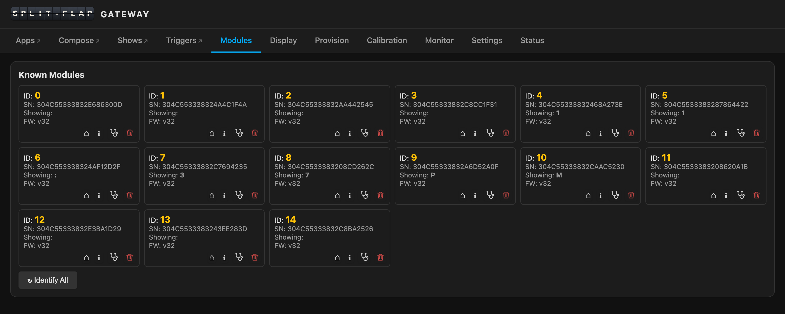</a>  
*Modules tab — every known module at a glance. Each card has icons to home it, inspect its EEPROM, run its self-diagnostics, or take a destructive action*

<a href="screenshots/gateway-display.png">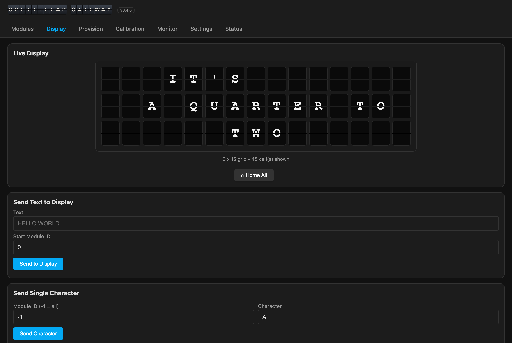</a>  
*Display tab — a live rendering of the wall, and boxes to push a string across the modules or address a single one*

<a href="screenshots/gateway-provision.png">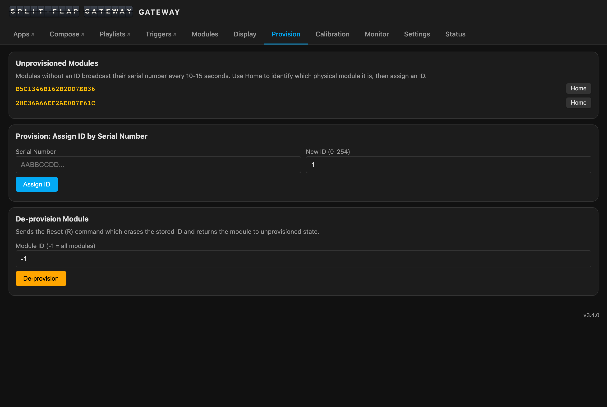</a>  
*Provision tab — unprovisioned modules appear by themselves; home one to see which physical tile it is, then assign an ID*

<a href="screenshots/gateway-calibration.png">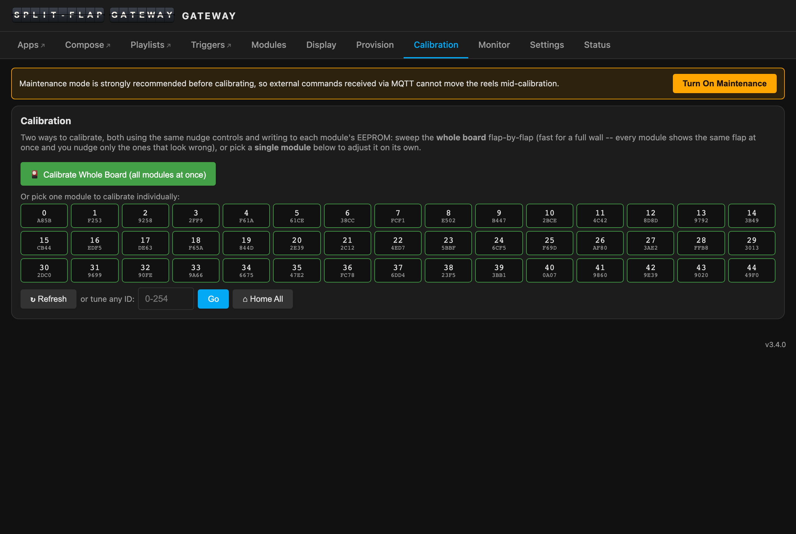</a>  
*Calibration tab — pick a module from a grid laid out like your wall, measure its steps, nudge its home position, tune any flap, or let the wizard walk every flap for you*

<a href="screenshots/gateway-monitor.png">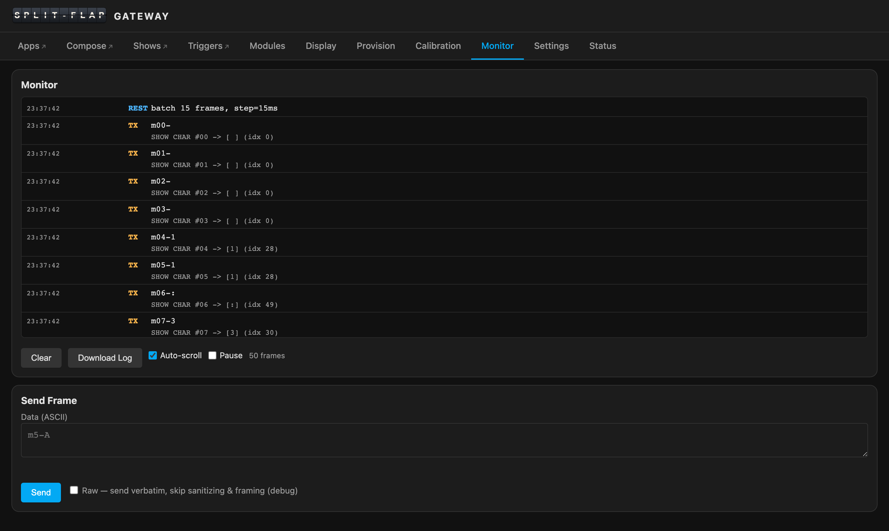</a>  
*Bus Monitor — every RS-485 frame in both directions, decoded into plain language, with timestamps in your browser's local time*

**A REST API** with more than fifty endpoints covering every operation — sending characters, homing, calibrating, running self-diagnostics, provisioning by serial number, backing up and restoring calibration, and reading or updating configuration. One call, `GET /api/capabilities`, tells a client exactly what characters this particular wall can show. An [OpenAPI specification](https://github.com/avandeputte/SplitFlapGateway/blob/main/openapi.yaml) is included so you can import the whole API into Postman or Swagger UI with a single file.

**MQTT integration** using the `splitflap/` topic prefix. Every frame that travels in either direction on the RS-485 bus is published. Module events each get their own topic. Turn on Home Assistant discovery and the gateway appears there as a device, with a text entity for the display, switches for maintenance and quiet time, and diagnostic sensors.

### It Looks After the Wall

A few things the gateway does on its own, because a display you want to forget about has to be able to look after itself:

- **A permanent module registry.** It remembers every module it has ever met — identity, firmware, flap set — across reboots, so the wall is fully known the second the gateway comes up.
- **Quiet time.** A schedule, a switch, or a Home Assistant automation blanks the wall for the night and puts back what it was showing in the morning.
- **Maintenance mode**, so home-automation traffic can't fight you while you calibrate.
- **Over-the-air updates** from the browser. After the first USB flash, you never need a cable again.

### Also Backward Compatible

The gateway speaks the same RS-485 protocol as everything else in this ecosystem. It works with Adam's original hardcoded firmware, with the universal firmware, and with existing tools like splitflap-os, which can drive it over MQTT. If you're already running splitflap-os on a Raspberry Pi and want to experiment with the gateway, the display protocol is identical — no changes to splitflap-os required.

---

## Limitation Three: What Do You Actually Show?

With the first two projects in place you have a wall that provisions and calibrates itself from a browser and takes an HTTP request from anywhere. And then you sit in front of it and realise that a split-flap display with nothing on it is furniture. The hard part was never sending a character. It's *deciding* what to show — the weather when you're leaving, the next train, the score of the game, a word clock at other times, a birthday message when someone walks in — and doing that every day, for years, without anyone having to think about it.

splitflap-os solves that for the Raspberry Pi setup, and solves it well. But it's built around living inside the display, next to the bus, and that is exactly the arrangement the gateway set out to remove.

### The Solution: A Content Engine That Lives Where You Do

The [Split-Flap Companion](https://github.com/avandeputte/SplitFlapGatewayCompanion) is the third piece. It's a web app that runs on a machine you already have — a Raspberry Pi, a NAS, a home server, or as a Home Assistant app — and drives the wall over the gateway's REST API. The gateway can put any character on any flap; the companion's job is to know which ones.

<a href="screenshots/companion-apps.png">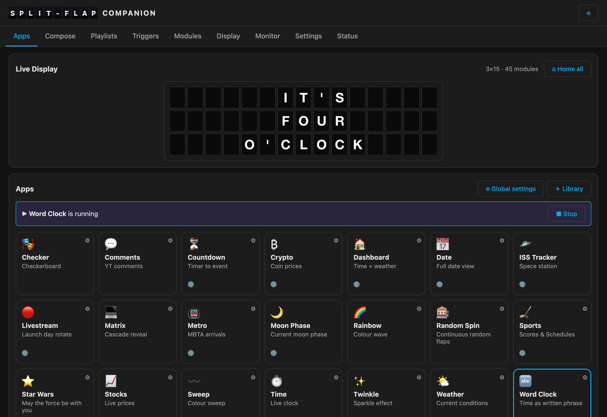</a>  
*The companion's Apps tab — the live board mirrors the wall (here the Time app is running), one tap runs an app, and the gateway's own tabs sit right in the companion's nav*

What's in it:

- **Apps.** A library of ready-to-run apps — weather, clocks, a word clock, stocks and crypto, transit arrivals, sports scores, the ISS passing overhead, countdowns, quotes, animations, and many more — each with its own settings. The library keeps growing, and you can add or remove apps from inside the companion.
- **Compose.** A click-to-type grid that mirrors your wall: click a cell, type, and each keystroke lands on that module. Colour tiles, every transition style, and a button to push the whole grid.
- **Playlists**, on the Shows tab. Sequence apps and messages with a duration for each, save, loop. The same app can appear twice with different settings — weather for two cities in two languages, say. A multiview splits the wall into zones that each run their own thing.
- **Schedules.** Run an app or a playlist in time-of-day windows per weekday, plus quiet hours.
- **Triggers.** Apps that watch for something — a game starting, the ISS coming over, a weather change — and briefly interrupt the display, then let it resume.
- **A live view** of the wall, updated in real time, and a Home All button.

<a href="screenshots/companion-compose.png">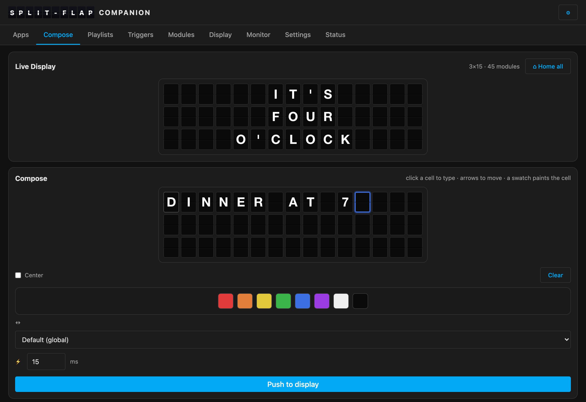</a>  
*Compose — click a cell, type, and it lands on the wall*

<a href="screenshots/companion-playlists.png">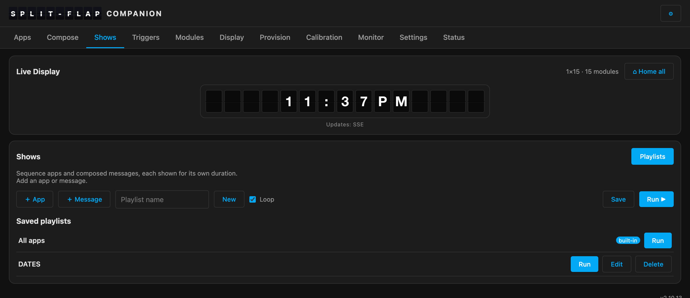</a>  
*Shows — sequence apps and messages into playlists, each entry with its own settings and duration*

### It Speaks Your Language — and Your Reel's

A global language setting (US, UK and Australian English plus the major Western-European languages) changes the translated words, the date order, the number format and the clock in every app that adapts, and currency and public holidays follow your *location*. Both can be overridden per app and per playlist entry, so one playlist can show Paris in French and Berlin in German back to back.

Whether those words can actually be shown depends on what's printed on your flaps, and this is where the three projects fit together. The gateway asks every module what its reel carries, and answers the companion's one question — *what can this wall show?* — in one call. The companion writes text the way a person writes it and lets the wall decide the case: uppercase on a physical split-flap, lowercase and accents on a display that has them. An app never needs to know which kind of wall it is talking to.

### It Fits Into What You Already Run

The companion plugs into **Home Assistant** three ways — as a sidebar app, as a HACS integration with real entities, and as an MQTT device — so the wall becomes a target for automations, voice, and dashboards. Two more doors are plain HTTP and need no Home Assistant at all:

- It **answers the Vestaboard Local API**, so the large pool of software written for that commercial split-flap display — integrations, Node-RED flows, scripts — drives your wall unchanged.
- It exposes the display as **MCP tools**, so an LLM such as Claude can read the board and drive it in plain language: *"put standup on the board for two minutes, then put back what was playing."*

One companion can drive **several walls**, each with its own apps, playlists and settings. And it keeps its own configuration *in the gateway's flash*, so the container is stateless: destroy it, start another one on a different machine, and it picks up where it left off.

<a href="screenshots/companion-displays.png">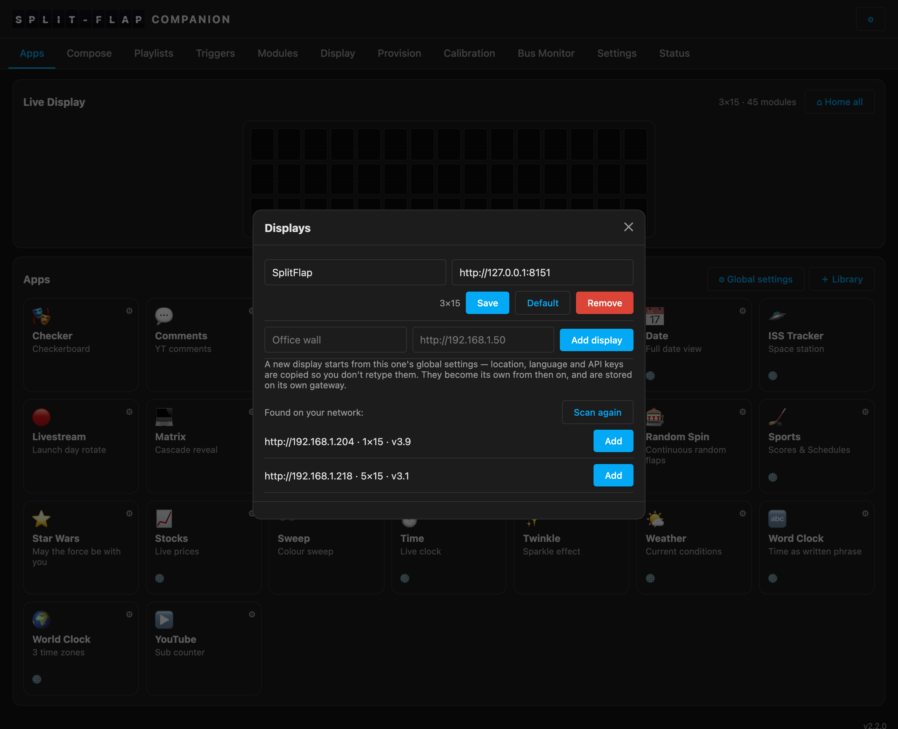</a>  
*Several walls from one companion — a network scan finds the gateways, one tap adds them*

### Also Backward Compatible

The companion's apps use the **splitflap-os plugin format** — a manifest plus a small Python file or a data file — and run on a behaviour-identical plugin runtime. Any app written for splitflap-os drops in unchanged, and an app you write for the companion is an app for splitflap-os too. The two projects share a format rather than compete for one.

---

## No Mechanical Build? Same Software, Different Wall

Because the companion only ever talks to a gateway, and the gateway's job is to *be* a wall of modules, two more boards offer the same thing with **virtual** flaps: the [Matrix Gateway](https://github.com/avandeputte/MatrixPortalGateway) on an RGB LED matrix, and the [LCD Gateway](https://github.com/avandeputte/SplitFlapGatewayLCD) on a 10.1" touchscreen. They are their own firmware, but they speak the same split-flap protocol (with a few capabilities a drawn flap can add, such as lowercase and accents) and present the same web UI and REST API, so each replaces the modules *and* the gateway in one board. The companion can't tell the difference, and the same app spells its text on a physical wall and draws a richer panel on the emulated one.

<a href="screenshots/companion-matrix-portal.png">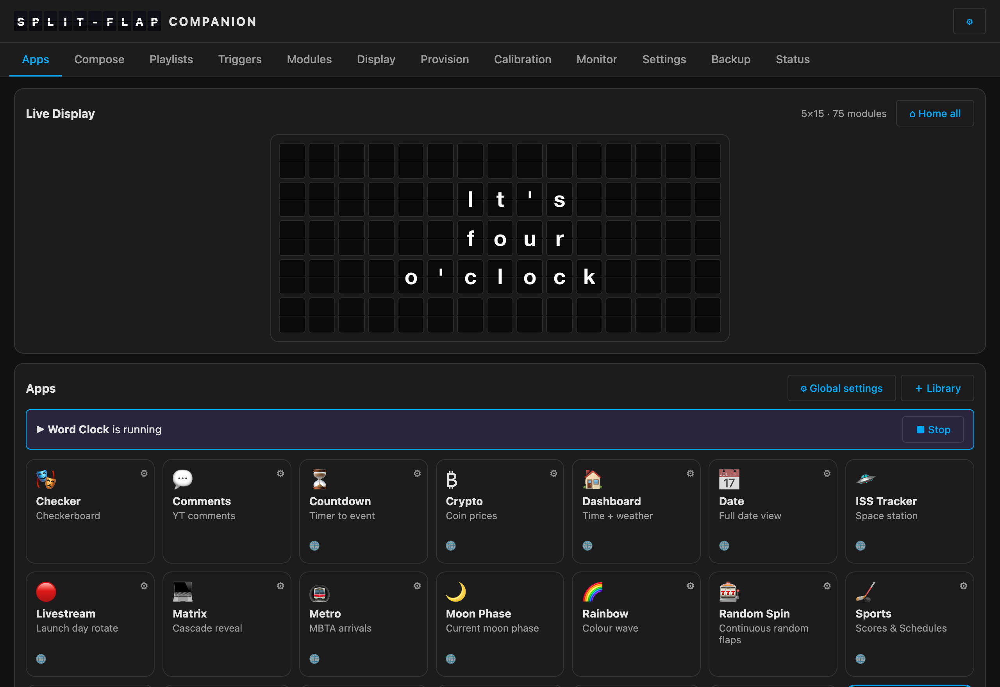</a>  
*The same Word Clock app, at the same minute, on an LED-matrix wall*

It's a good way to try the whole stack before cutting a single flap — and a good display in its own right.

---

## Three Projects, Independently Useful

These are three separate projects that solve three different problems. They work best together, and the wiki's [Quick Start](https://github.com/avandeputte/SplitFlapGateway/wiki/Quick-Start) walks that path — but none of them depends on the others:

- **Universal firmware without the gateway** — keep the Raspberry Pi, provision from splitflap-os or the included terminal tool, and you still get one binary for all modules, backup and restore by serial number, custom flap sets and self-diagnostics.

- **Gateway without the universal firmware** — happy with Adam's original hardcoded firmware and just want the Pi out of the display? The gateway works perfectly: send characters, home, calibrate, monitor the bus, control the wall from anywhere on your network. You just won't have provisioning, since the original firmware doesn't support it.

- **Gateway without the companion** — drive it by hand from its own web UI, from your own scripts against the REST API, from Home Assistant over MQTT, or from splitflap-os.

- **All three together** — flash once, provision and calibrate from a browser, and let the companion decide what the wall shows, when, and in which language, from wherever you already run things.

Every viable mix is compared, with a feature grid, in the wiki's [Choosing a Configuration](https://github.com/avandeputte/SplitFlapGateway/wiki/Choosing-a-Configuration).

<a href="screenshots/configurations.png">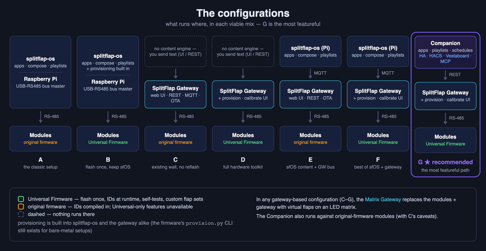</a>  
*Every combination is a working display; they differ in what you get around it*

The goal in every case was the same: make Adam's beautiful hardware easier to live with long-term — without breaking the growing community of projects already built around it.

---

## Getting Started

- **[The SplitFlap wiki](https://github.com/avandeputte/SplitFlapGateway/wiki)** — the complete guide, from a bare board to a message on the wall; the [Quick Start](https://github.com/avandeputte/SplitFlapGateway/wiki/Quick-Start) is the recommended path
- **[Adam G Makes on YouTube](https://www.youtube.com/@AdamGMakes)** — start here for the hardware build
- **[SplitFlapUniversalFirmware](https://github.com/avandeputte/SplitFlapUniversalFirmware)** — flash this onto your modules for runtime provisioning, custom flap sets and self-diagnostics
- **[SplitFlapGateway](https://github.com/avandeputte/SplitFlapGateway)** — flash this onto the ESP32-S3 to take the Raspberry Pi out of your display; a [prebuilt image](https://github.com/avandeputte/SplitFlapGateway/releases) needs no build environment
- **[SplitFlapGatewayCompanion](https://github.com/avandeputte/SplitFlapGatewayCompanion)** — the content engine: apps, playlists, schedules, triggers; runs in Docker or as a Home Assistant app
- **[splitflap-os](https://github.com/csader/splitflap-os)** — csader's full-featured web UI and app library, if you're keeping the Raspberry Pi
- **[Waveshare ESP32-S3-RS485-CAN on Amazon](https://www.amazon.com/dp/B0FNCWZ3D1)** — the recommended gateway hardware
