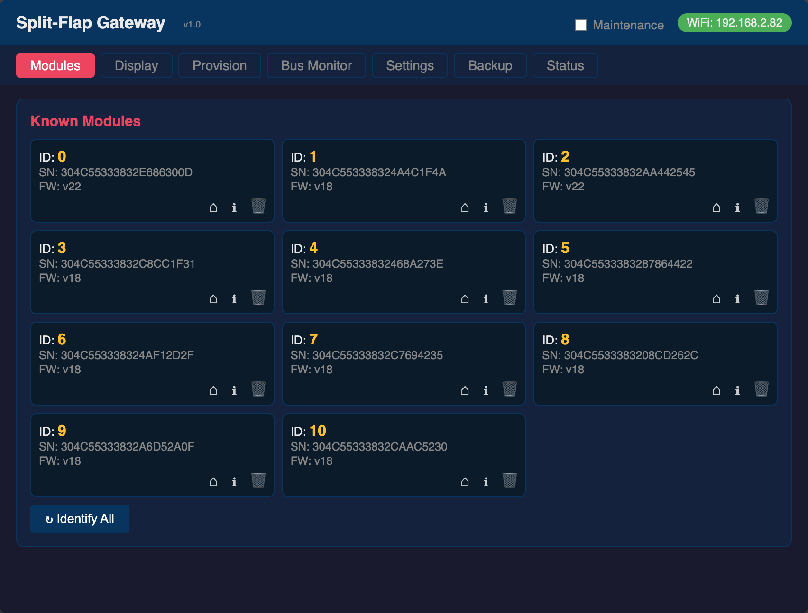
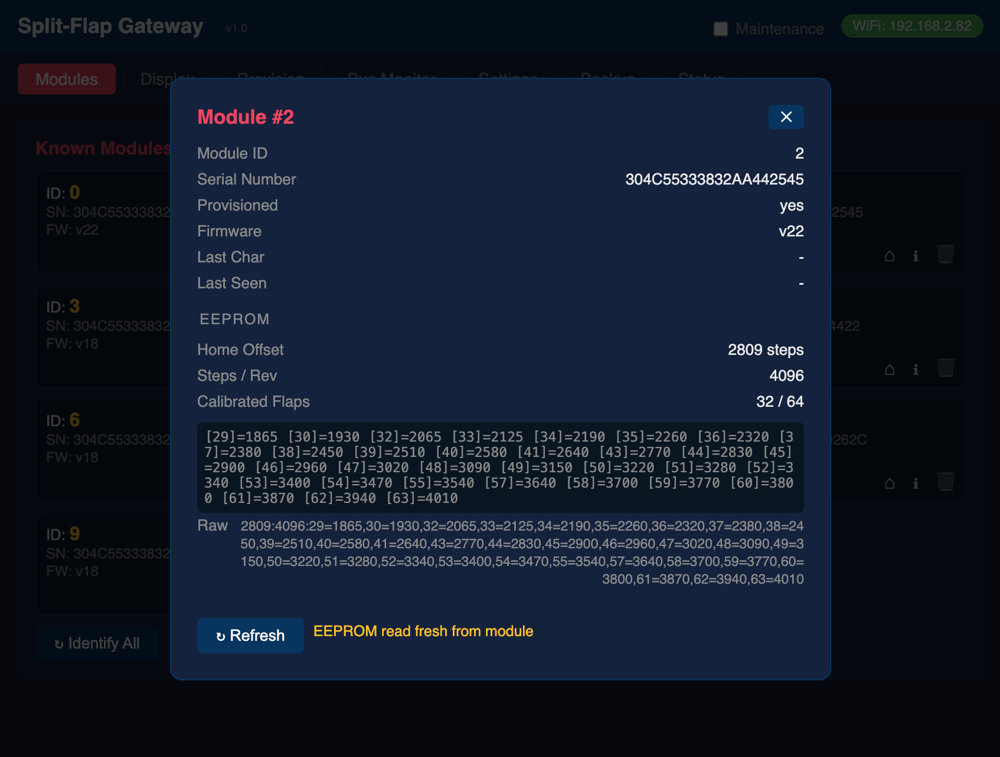
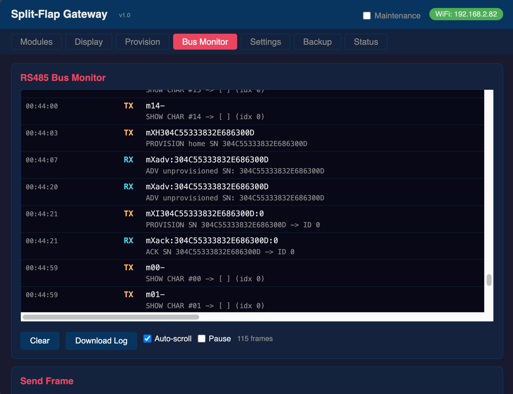
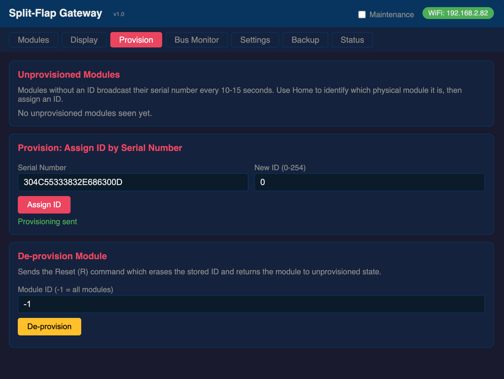
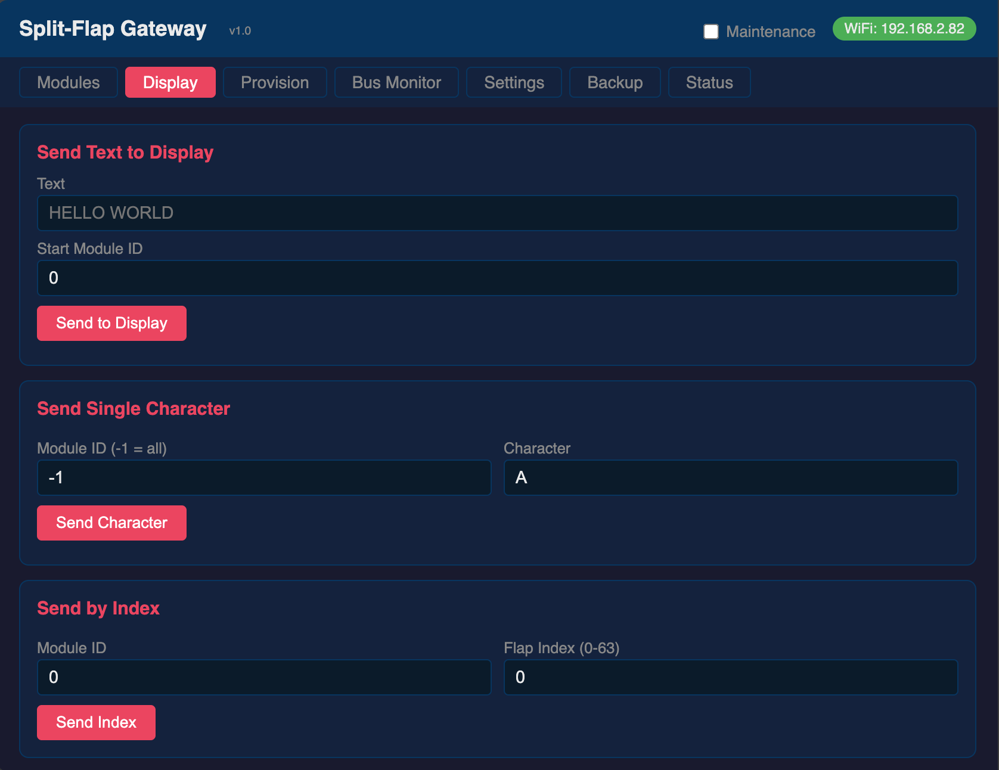
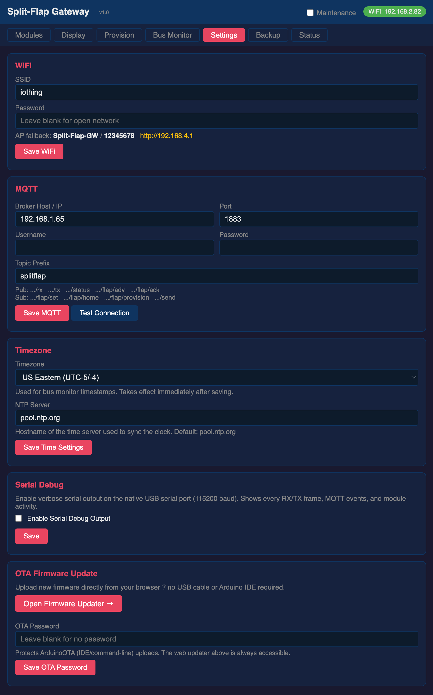
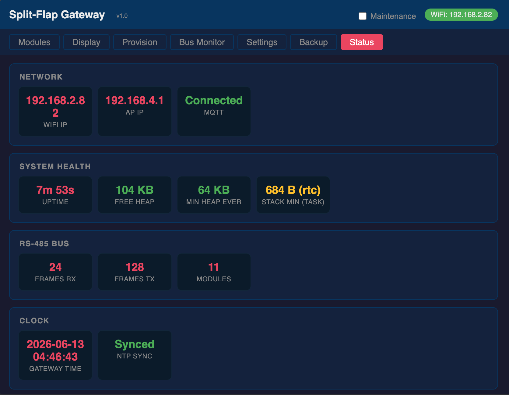

# Two Projects, One Goal: Making Split-Flap Displays Easier to Build and Run

If you've ever wanted to build one of those beautiful mechanical split-flap displays you see in train stations and airports, you've probably come across [Adam G Makes](https://www.youtube.com/@AdamGMakes) on YouTube. His [split-flap display project](https://youtu.be/-C8_AtxEEQc?si=Gym5wikeFH2vUNRm) is a masterpiece of DIY engineering — each character cell is a compact, self-contained module built around an ATtiny1616 microcontroller, driven by a stepper motor with a Hall sensor for positioning, and connected to a shared RS-485 bus. The result is a display that looks and sounds exactly like the real thing.

The hardware is excellent. But as the community around this project has grown, two separate limitations have emerged that make the display harder to scale and maintain than it needs to be. This post is about two independent projects that each tackle one of those limitations — and why both were built with great care not to break anything that already works.

---

## Limitation One: One Firmware Per Module

In Adam's original firmware, each module's bus address — the ID that tells it which RS-485 commands to respond to — is **hardcoded directly into the firmware binary**. Module 1 has a different firmware than module 5, which has a different firmware than module 38. Every single module requires its own edit-compile-and-flash cycle before it can be installed.

For a small display with a handful of modules this is merely tedious. For a larger display with dozens of modules it becomes a genuine logistical burden. Each module must be individually flashed with a customised binary before installation. Swap a module, and you flash again. Rearrange the physical layout, and you're back to the IDE.

### The Solution: Universal Firmware with Runtime Provisioning

The [SplitFlapUniversalFirmware](https://github.com/avandeputte/SplitFlapUniversalFirmware) solves this by eliminating the hardcoded ID entirely. You still flash each module yourself — this is a DIY project after all — but every module runs the **exact same firmware binary**. Flash it once per module, and you're done. Identity is assigned at runtime through provisioning, not at compile time. As a side note, this also means Adam could, if he ever wanted to, sell pre-flashed modules — since the firmware is universal, a module can come straight out of the box, get plugged into the bus, and be provisioned on the spot without anyone ever touching the IDE.

Every ATtiny1616 microcontroller has a factory-programmed, globally unique 10-byte serial number burned into its silicon. The universal firmware reads this at boot and uses it as the module's permanent identity. When a module powers up without an assigned bus ID, it broadcasts its serial number on the RS-485 bus every 10–15 seconds (with randomised intervals to avoid collisions when many modules power on simultaneously).

To claim a module, a host system sends a provisioning command:

```
mXIA3F24C0018E7D29B3F01:38\n
```

This tells the module with that serial number to assign itself bus ID 38, write it to EEPROM, and stop advertising. From that moment on it behaves exactly like any other module on the bus. To physically identify which module corresponds to which serial number before assigning, a home-by-serial command spins only the matching module:

```
mXHA3F24C0018E7D29B3F01\n
```

One binary. Flash once per module, provision once, done.

### Backward Compatibility Was Non-Negotiable

The universal firmware was built with full backward compatibility as a hard requirement. Every command from Adam's original protocol works exactly as before — the same syntax, the same responses, the same timing. Projects already built on the original firmware continue to work unchanged.

A good example is [splitflap-os](https://github.com/csader/splitflap-os) by csader — a polished web-based control interface with over 40 apps (weather, stocks, sports scores, word clock, news headlines and more), playlists, live preview, calibration tools, and Home Assistant integration via MQTT. It runs on the Raspberry Pi alongside the display and speaks the same RS-485 protocol. The universal firmware adds provisioning commands without touching anything splitflap-os uses — both work together without any modifications.

Because the provisioning protocol is open and well-documented, splitflap-os could choose to add a provisioning UI that would make `provision.py` entirely obsolete — module discovery, identification, and ID assignment all from the same web interface already used to control the display. That's entirely up to the splitflap-os project to decide; the universal firmware simply makes it possible.

---

## Limitation Two: A Computer Inside the Display

In the original project setup, the RS-485 bus connects directly to a Raspberry Pi that lives physically inside or alongside the display assembly. The Pi is the brains of the operation — it drives the bus, runs whatever software controls the display, and handles all the application logic.

On the surface that sounds fine. In practice it means you have a full Linux computer embedded in your display. That computer needs to be maintained. OS updates, security patches, SSH access, a filesystem that can corrupt if you pull the power at the wrong moment. If something goes wrong with the Pi, your display stops working. For a decorative display you just want to run reliably for years, that's a surprising amount of ongoing responsibility.

### The Solution: A Microcontroller That Does One Job

The [Split-Flap Gateway](https://github.com/avandeputte/SplitFlapGateway) replaces the Raspberry Pi with a single low-cost microcontroller board — the [Waveshare ESP32-S3-RS485-CAN](https://www.amazon.com/dp/B0FNCWZ3D1) — that does exactly one thing: bridge the RS-485 bus to your WiFi network. No operating system to patch. No filesystem to corrupt. The firmware lives in flash memory, boots in under a second, and runs indefinitely without intervention.

The "heavy stuff" — the UI, the automation logic, the integration with other systems — runs somewhere you already own and maintain. Your PC, your NAS, a home automation server. You're not adding a new computer to maintain; you're connecting to infrastructure you already have.

Beyond simply replacing the Raspberry Pi, the gateway opens up integration possibilities that didn't exist before. In the original project the only way to talk to the display is the RS-485 bus protocol — which means anything that wants to control the display needs to be physically wired to the bus and speak that low-level protocol directly. The gateway changes that completely. By bridging the bus to WiFi and exposing it through REST and MQTT, it means any device on your network — a phone, a laptop, a home automation controller, a cloud service — can send a character to the display with a single HTTP request or MQTT message, no knowledge of RS-485 required.

The gateway exposes the bus through three interfaces simultaneously:

---

<a href="screenshots/modules.png"></a>  
*Modules tab — every known module at a glance. Each card has icons to home it, inspect its EEPROM, or run a destructive action*

<a href="screenshots/modules_info.png"></a>  
*Module info — all known data for a module plus its EEPROM read fresh from the bus and parsed into home offset, steps-per-rev, and the calibrated flap map*

<a href="screenshots/bus_monitor.png"></a>  
*Bus Monitor — live RS-485 traffic with human-readable protocol decoding and browser-local timestamps; pause, download, and auto-scroll controls*

<a href="screenshots/provision.png"></a>  
*Provision tab — unprovisioned modules appear automatically; home one to identify which physical tile it is, then assign an ID*

<a href="screenshots/display.png"></a>  
*Display tab — push a whole string across sequential modules, send one character, or address a specific flap by index*

<a href="screenshots/settings.png"></a>  
*Settings tab — WiFi, MQTT broker (with a connection tester), timezone, NTP server, and OTA firmware update; all saved to flash*

<a href="screenshots/status.png"></a>  
*Status tab — system health grouped into Network, System Health, RS-485 Bus, and Clock, with color-coded heap and stack indicators*

---

**A web UI** served directly from the ESP32. Open a browser, navigate to the gateway's IP address, and you have a full dashboard: a live bus monitor showing every RS-485 frame with decoded descriptions and local timestamps, a module grid showing all known modules with their current character and firmware version, provisioning tools, and configuration settings. No app to install, no account to create.

**A REST API** with more than 40 endpoints covering every operation — sending characters, homing modules, calibrating, running module self-diagnostics, provisioning by serial number, querying firmware versions, and reading or updating configuration. An [OpenAPI specification](https://github.com/avandeputte/SplitFlapGateway) is included so you can import the entire API into Postman or Swagger UI with a single file.

**MQTT integration** using the `splitflap/` topic prefix. Every frame that travels in either direction on the RS-485 bus is published. Module events each get their own topic. Any system that can publish an MQTT message can drive the display — Node-RED, Home Assistant, a Python script, or a shell command.

### Also Backward Compatible

The gateway speaks the same RS-485 protocol as everything else in this ecosystem. It works with Adam's original hardcoded firmware, with the universal firmware, and with existing tools like splitflap-os. If you're already running splitflap-os on a Raspberry Pi and want to experiment with the gateway, the display protocol is identical — no changes to splitflap-os required.

---

## Two Projects, Independently Useful

These are two separate projects that solve two different problems. They work very well together, but neither depends on the other:

- **Universal firmware without the gateway** — if you're content to keep the Raspberry Pi and use the included `provision.py` terminal tool to manage modules, the universal firmware stands completely on its own. You get runtime provisioning, one binary for all modules, and full compatibility with everything else in the ecosystem.

- **Gateway without the universal firmware** — if you're happy with Adam's original hardcoded firmware and just want to remove the Raspberry Pi from the display, the gateway works perfectly. You can still send characters, home modules, monitor the bus in real time, and control the display from anywhere on your network. You just won't have the dynamic provisioning workflow, since the original firmware doesn't support it.

- **Both together** — the gateway's web UI includes a full provisioning interface for the universal firmware: discover unprovisioned modules, home them to identify which physical tile they are, and assign IDs, all from a browser.

The goal in both cases was to make Adam's beautiful hardware easier to live with long-term — without breaking the growing community of projects already built around it.

---

## Getting Started

- **[Adam G Makes on YouTube](https://www.youtube.com/@AdamGMakes)** — start here for the hardware build
- **[SplitFlapUniversalFirmware](https://github.com/avandeputte/SplitFlapUniversalFirmware)** — optional: flash this onto your modules to enable runtime provisioning
- **[SplitFlapGateway](https://github.com/avandeputte/SplitFlapGateway)** — optional: flash this onto the ESP32-S3 to remove the Raspberry Pi from your display
- **[splitflap-os](https://github.com/csader/splitflap-os)** — a full-featured web UI with 40+ apps, if you're keeping the Raspberry Pi
- **[Waveshare ESP32-S3-RS485-CAN on Amazon](https://www.amazon.com/dp/B0FNCWZ3D1)** — the recommended gateway hardware
