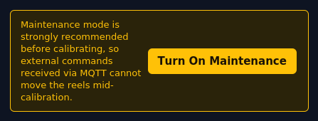
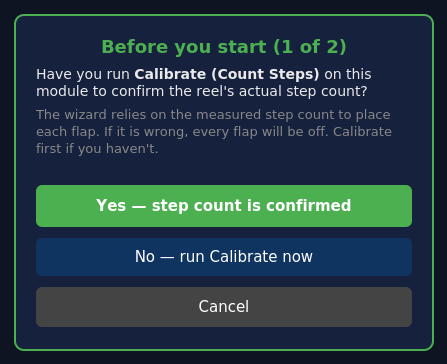
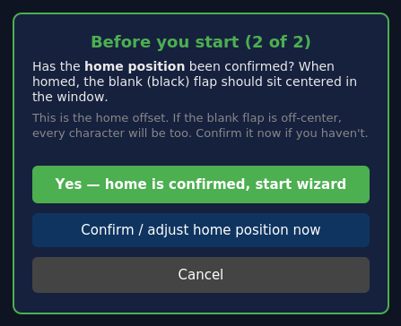
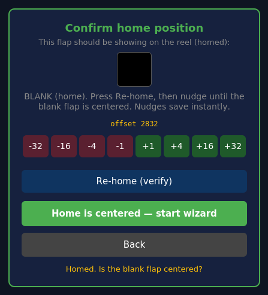
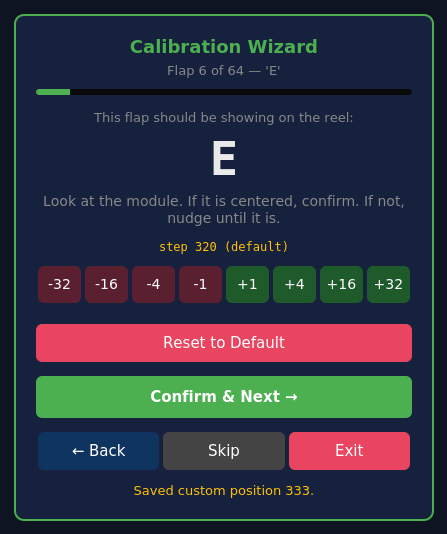

# Module Calibration Guide

How to calibrate a split-flap module from the gateway's web UI — for a brand-new
module, a module whose **home position is wrong** (the blank flap isn't centered),
or a module where **one or more characters land off-center**.

Everything here is done from the **Calibration** tab of the gateway web UI. No
serial console or special tools are required.

---

## Before you start

**What calibration actually controls.** Each module stores three things in its
own EEPROM:

- **Total Steps** — how many motor steps make one full revolution of the reel.
  This is the single most important value: every flap position is derived from
  it. The factory default is `4096`, but the true value of a given reel can be
  slightly different (e.g. `4097`) or substantially different on other hardware.
- **Home Offset** — how many steps past the hall-sensor trigger the reel must
  move to land the blank flap (index 0) centered in the window. Default `2832`.
- **Character Map** — an optional per-flap fine-tune. For each flap the module
  can store a custom step position. If a flap has no custom value, the module
  computes its position as `(index × Total Steps) / flap count` — the flap count
  is 64 by default, or the module's configured count on firmware v31+.

**The golden order.** Always calibrate in this order, because each step depends
on the one before it:

1. **Total Steps** (Count Steps) — sets the scale everything else is measured in.
2. **Home Offset** — centers the blank flap so the whole reel is aligned.
3. **Individual characters** — only the few flaps that still land off after 1–2.

Doing them out of order wastes effort: if you hand-tune characters and *then*
change Total Steps, all the default positions shift and you may have to redo your
work.

> **Turn on Maintenance mode first.** Calibration physically spins the reels.
> If an external system sends a display command over MQTT mid-calibration, it
> can move a reel while you're working on it. A yellow reminder with a **Turn On
> Maintenance** button sits at the top of the Calibration tab — click it before
> you begin. The reminder disappears once Maintenance is on. The web UI keeps
> working normally in Maintenance mode; only MQTT-sourced commands are ignored.
> Turn Maintenance back off when you're done.

---

## Step 0 — Select the module

1. Open the **Calibration** tab.
2. The grid mirrors your display layout (one cell per module position, IDs `0`
   to rows×cols−1). Cells are color-coded:
   - **Green border** — a known module (modern firmware, has a serial number).
   - **Yellow border / "v7"** — a legacy module (firmware v7 or earlier). These
     have no serial number and can't be provisioned or factory-reset, but they
     fully support homing and calibration.
   - **Dimmed** — not yet seen on the bus.
3. Click the module you want to calibrate. If it isn't in the grid (e.g. an ID
   outside the configured layout), type it into **"or tune any ID"** and press
   **Go**.

The detail card opens showing the module's current **Home Offset** (green) and
**Total Steps** (yellow), read live from its EEPROM, plus the **Character Map**.

> If a value looks stale, click **Re-read EEPROM** at the top of the card to
> fetch a fresh copy from the module.

---

## Step 1 — Measure Total Steps (Count Steps)

Do this first on any new module, and any time the reel has been mechanically
changed.

1. Click **Count Steps** (next to the Total Steps field) — or the **Calibrate**
   button in the "New module?" notice; they do the same thing.
2. Confirm the prompt. The reel will **spin a full revolution** to measure
   itself. This takes a few seconds (up to ~15s); the button shows "Counting…"
   while it works.
3. When it finishes, the measured steps/rev appears in the **Total Steps** field
   and is saved to the module's EEPROM automatically. The status line reads
   "Total steps measured and saved: N."

You normally never type Total Steps by hand — let **Count Steps** measure it. The
**Save** button next to the field is there if you ever need to enter a known
value manually, and **Revert** resets it to the firmware default (`4096`).

---

## Step 2 — Fix the home position (blank flap not centered)

After homing, flap 0 (the blank/black flap) should sit centered in the window.
If it's high or low, the **Home Offset** is off. There are two ways to adjust it;
use whichever you prefer.

### Option A — Nudge live (easiest)

The nudge row (`−32 −16 −4 −1 / +1 +4 +16 +32`, labeled **NUDGE OFFSET**) moves
the reel **and** saves the new offset **instantly** with each press.

1. Watch the physical reel.
2. Press a nudge button. The reel moves by that many steps and the offset is
   saved immediately.
   - Use the big steps (±16, ±32) to get close, then ±1/±4 to fine-tune.
3. When the blank flap is centered, click **Home Motor** to re-home and confirm
   it lands correctly.

Because nudge saves instantly, there's no separate save step — what you see is
what's stored.

### Option B — Set an exact offset

If you already know the offset value you want:

1. Type it into the **Home Offset** field.
2. Click **Save**. (Unlike nudge, this sets the value but does **not** move the
   reel.)
3. Click **Home Motor** to re-home and verify.

To start over, click **Revert** next to Home Offset to reset it to the default
(`2832`), then re-home and re-nudge.

> **Always finish with Home Motor.** The offset only takes visible effect after
> the reel re-homes. If you adjust and don't re-home, the flap won't appear to
> move.

---

## Step 3 — Fix individual characters

Once Total Steps and Home Offset are right, most flaps will land correctly on
their own, because the module computes each position from Total Steps. Only tune
the specific characters that are still visibly off-center.

### Reading the Character Map

Each cell shows a character (or a colored swatch for the 7 color flaps, or a
black square for the blank) and its current step position:

- **Grey value** — the flap is using the computed firmware default
  (`(index × Total Steps) / 64`). Nothing custom is stored.
- **Green value / green border** — a custom position is stored in EEPROM for this
  flap.

### Tuning one character

1. Click the character's cell. The **Tune** dialog opens, showing the character,
   its **Default** position, and (if one exists) its **Current EEPROM** value.
   The **Absolute Target Step** field starts at the current value.
2. Click **Test Position (GOTO)**. The reel moves to that step so you can see
   exactly where the flap lands. *This is a test only — it does not save.*
3. Adjust the target and test again until the flap is centered:
   - Use the nudge buttons in the dialog (`−32 … +32`) to change the **Absolute
     Target Step** value. These **only edit the number** — they do not move the
     reel or save anything.
   - After each adjustment, press **Test Position (GOTO)** again to see the new
     spot.
   - Repeat *Test → adjust → Test* as many times as you like.
4. When the flap lands perfectly, click **Lock to EEPROM**. The position is saved
   and the cell turns green (custom).

### Reverting a character to its default

If you want a flap to go back to using the computed default (for example, you
tuned it by mistake, or you re-measured Total Steps and want it recalculated):

1. Open the character's Tune dialog.
2. Click **Revert to Default**.

This **unsets** the custom value in the module's EEPROM (it's cleared, not
overwritten with a number), so the module goes back to computing the position
from Total Steps. The cell returns to grey.

---

## The Calibration Wizard (guided, recommended)

Steps 1–3 above can all be done by hand, but the **Calibration Wizard** walks you
through the entire process automatically: it steps through every flap one at a
time, moves the reel to each one so you can see it, and lets you confirm or adjust
each before saving. It's the easiest way to do a full pass on a new module. The
Wizard and the Character Map follow the module's own character order and flap
count (its custom flap set on firmware v31+, or the default 64-flap reel otherwise).

Start it from the **Calibration Wizard (step through all flaps)** button under the
Character Map.

### The wizard checks your prerequisites first

Because every flap position depends on the step count and home offset, the wizard
asks about both before it begins.

**1 of 2 — Step count.** Confirms you've measured this reel's true steps per
revolution. If you haven't, choose **No — run Calibrate now** and it runs Count
Steps for you; re-open the wizard when it finishes.

**2 of 2 — Home position.** Confirms the blank (black) flap is centered when
homed — this is the home offset. If you're not sure, choose **Confirm / adjust
home position now**.

**Confirming the home position.** This homes the reel and shows the blank flap.
Use the nudge buttons until the black flap is centered in the window — each nudge
moves the reel and **saves the home offset instantly**. Press **Re-home (verify)**
to re-home and check, then **Home is centered — start wizard** to continue.

### Stepping through the flaps

For each flap, the wizard moves the reel to that character and shows you which one
*should* be displayed:

- Look at the module. If the shown character is centered, click **Confirm &
  Next** to save it and advance.
- If it's off, use the **nudge buttons** (`−32 … +32`). Each nudge moves the reel
  so you can see the change. Adjust until centered, then **Confirm & Next**.
- **Reset to Default** returns this flap to its computed default position and
  clears any custom value — useful if a previous tune was wrong.
- **Skip** advances without saving. **← Back** revisits the previous flap.
  **Exit** stops the wizard (flaps you already confirmed stay saved).

### What gets saved

The wizard keeps the module's EEPROM tidy:

- A flap you **adjusted** away from its default is saved as a **custom** position
  (it turns green in the map).
- A flap that was **already correct** at its default is left as a computed default
  (stays grey) — so if you re-measure Total Steps later, it recalculates
  automatically.
- A flap that **had** a custom value but you reset/nudged back to the default has
  its custom value **cleared**.

The status line under each flap tells you exactly what happened ("Saved custom
position 333", "Already at default — no change needed", and so on). When you reach
the last flap, the wizard closes and refreshes the Character Map.

### Calibrating the whole board at once

The per-module wizard above is the way to dial in one module. When you're
checking or correcting an **entire wall**, the **Calibrate Whole Board** button
(in the same **Calibration** section) is faster: it steps *every* module to the
same flap at once, so you walk the wall one character at a time instead of one
module at a time.

For each flap, every module is told to show that character (a single broadcast,
so each module uses its own saved map). Look across the wall:

- Modules that are correct need nothing — move on with **Next**.
- For any module that's **off**, click its cell in the grid. That loads the
  module and opens the same per-character nudge dialog used everywhere else;
  adjust until centered and the fix is saved to that module. The cell turns green
  to mark it fixed.
- **Prev / Next** move between flaps, and you can jump straight to a specific
  flap. **Finish** ends the pass.

Because it reuses the single-module tuning dialog, corrections behave identically
(same nudge steps, same custom-vs-default save rules as above). The whole-board
wizard also leaves **Maintenance mode exactly as it found it** — if maintenance
was off when you started, it's turned back off when you finish.

A cell flagged **DUP?** means two modules may share that ID; nudging it could move
or save the wrong module, so the wizard asks you to confirm before correcting it.
Resolve duplicate IDs (deprovision and reassign) before relying on a whole-board
pass.

---

## Typical workflows

### A brand-new module

The quickest path is the **Calibration Wizard**, which handles all of this in one
guided flow:

1. Turn on **Maintenance** mode.
2. Select the module.
3. Click **Calibration Wizard**. When it asks, run **Calibrate** (step count) and
   confirm the **home position** in the intro steps.
4. Step through the flaps, confirming or nudging each.
5. Turn **Maintenance** back off.

Or do it manually:

1. Turn on **Maintenance** mode.
2. Select the module.
3. **Count Steps** to measure and save Total Steps.
4. Click **Home Motor**; if the blank flap isn't centered, **nudge** the Home
   Offset until it is, then **Home Motor** again to confirm.
5. Send a few test characters (from the Display tab) and tune any flaps that land
   off-center using the Character Map.
6. Turn **Maintenance** back off.

### "The home position is wrong" (blank flap off-center)

1. Maintenance on → select the module.
2. Click **Home Motor** to see the current home.
3. **Nudge** the Home Offset (Step 2A) until the blank flap is centered, re-home
   to confirm.
4. Maintenance off.

If homing is *wildly* off (not just a small offset), the Total Steps value is
probably wrong — run **Count Steps** (Step 1) first, then redo the offset.

### "One or more characters are wrong" but the blank flap is fine

1. Maintenance on → select the module.
2. Confirm Home Offset is good (blank flap centered after **Home Motor**). If the
   blank is fine but *every* character is progressively more off the further it
   is from blank, that's a **Total Steps** problem — run **Count Steps** and
   recheck before tuning individual flaps.
3. For each wrong flap: click its cell → **Test Position (GOTO)** → adjust →
   **Lock to EEPROM** (Step 3).
4. Maintenance off.

> **Rule of thumb:** if only a *few scattered* flaps are off, tune them
> individually. If *all* flaps drift more the farther they are from blank, fix
> **Total Steps** first — one measurement corrects them all at once.

---

## Quick reference

| Control | What it does | Saves? | Moves reel? |
|---|---|---|---|
| **Count Steps** | Measures steps/revolution and stores it | Yes | Yes (1 rev) |
| **Total Steps → Save** | Stores a hand-entered steps/rev | Yes | No |
| **Total Steps → Revert** | Resets to default `4096` | Yes | No |
| **Nudge Offset (±)** | Adjusts home offset live | Yes (instant) | Yes |
| **Home Offset → Save** | Stores an exact offset | Yes | No |
| **Home Offset → Revert** | Resets to default `2832` | Yes | No |
| **Home Motor** | Re-homes the reel (verifies the offset) | — | Yes |
| **Test Position (GOTO)** | Moves to a step to preview a flap | No | Yes |
| **Tune dialog nudge (±)** | Edits the target step number only | No | No |
| **Lock to EEPROM** | Saves a custom position for that flap | Yes | No |
| **Revert to Default** | Clears the custom position (uses computed default) | Yes | No |
| **Calibration Wizard** | Guided pass through all 64 flaps | per flap | Yes |
| **Wizard: Confirm & Next** | Saves the flap (smartly) and advances | Yes | No |
| **Wizard: nudge (±)** | Adjusts the flap and moves the reel to show it | No (until confirm) | Yes |
| **Wizard: Reset to Default** | Returns the flap to its computed default | Yes | Yes |
| **Wizard: Skip / Back / Exit** | Navigate without saving | No | No |

---

## Tips & troubleshooting

- **Re-read EEPROM** any time you want to confirm what's actually stored on the
  module versus what's on screen.
- **A value won't "stick"?** Make sure you clicked **Save** (or **Lock to
  EEPROM** in the tune dialog). The only control that saves automatically is the
  **Nudge Offset** row.
- **Nothing moves after changing the offset?** The offset only shows after the
  reel re-homes — click **Home Motor**.
- **The whole reel is off by a consistent amount** → Home Offset. **The error
  grows the farther a flap is from blank** → Total Steps. **Just a few random
  flaps are off** → tune those characters individually.
- **Legacy (v7) modules** calibrate exactly the same way — Count Steps, Home
  Offset, and per-character tuning all work. They simply can't be provisioned or
  factory-reset.
- **Don't forget to turn Maintenance mode back off** when you finish, or the
  display will stop responding to MQTT commands.
