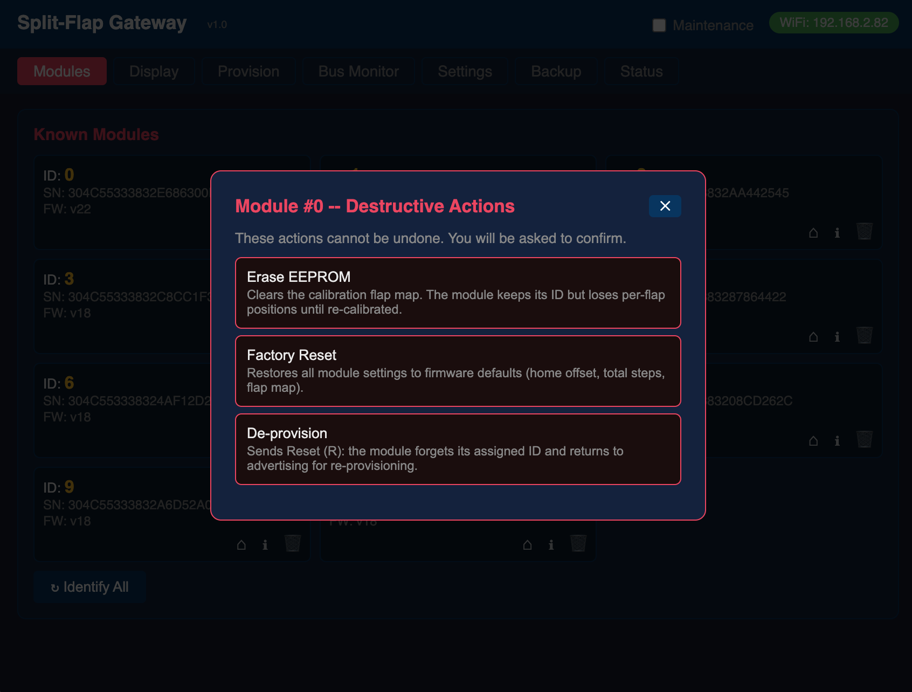
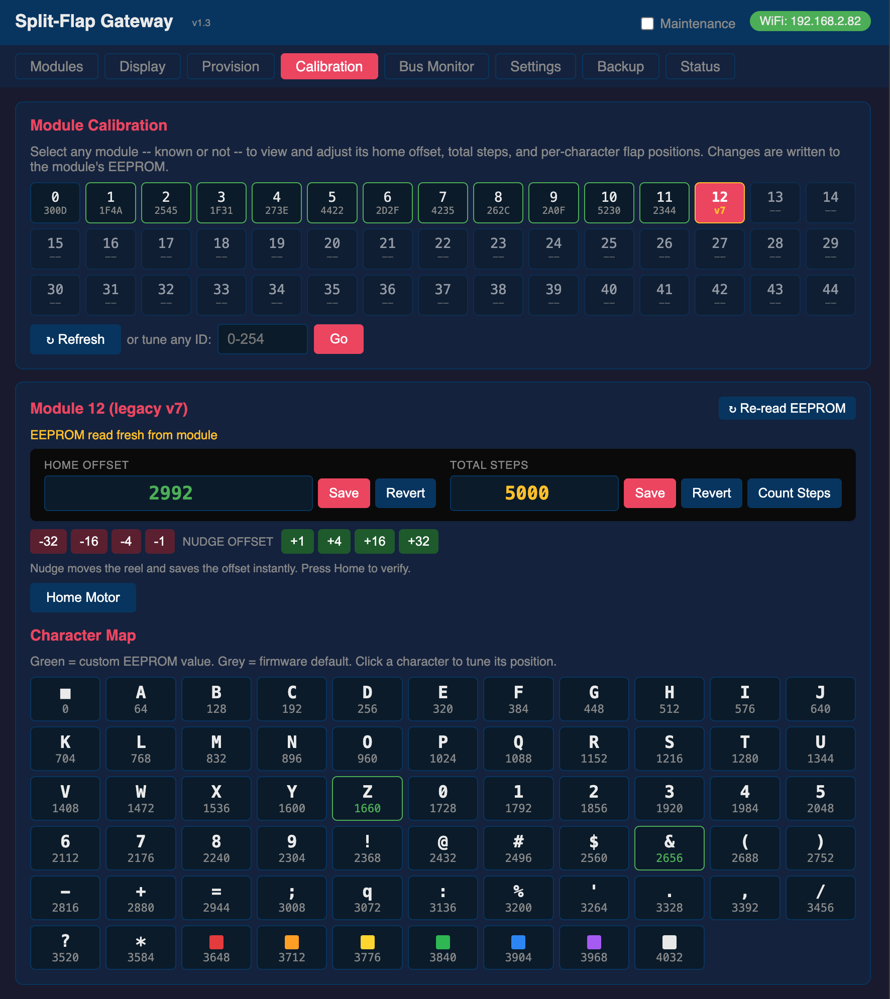
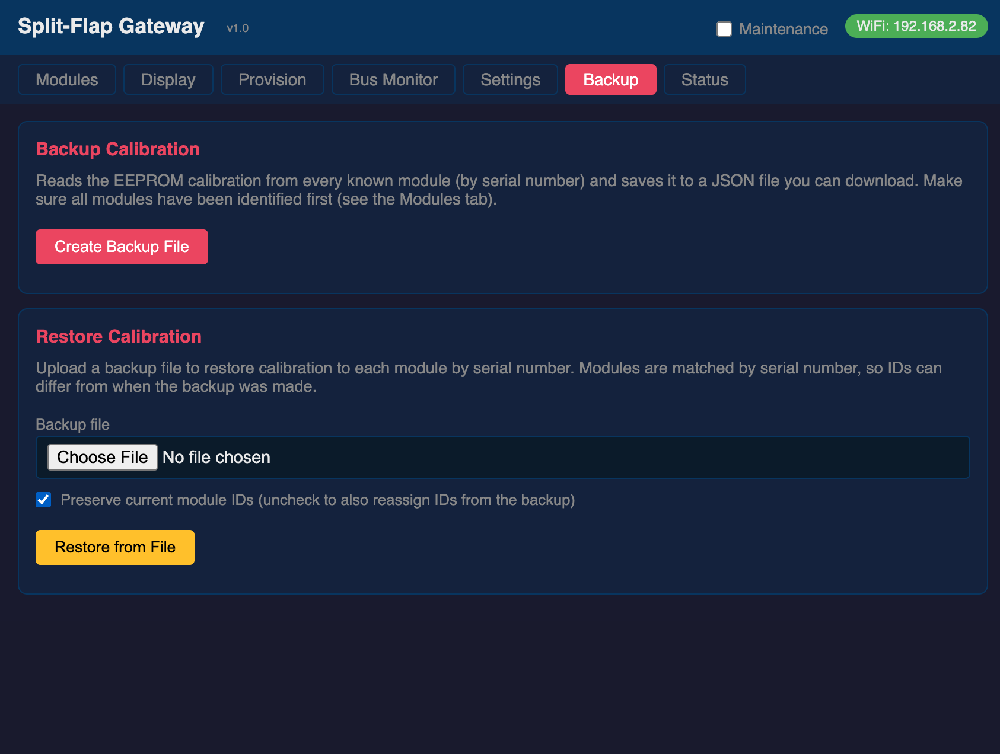

# Split-Flap Gateway

**Firmware version: 3.8.0**

> [!NOTE]
> **New to this project?** Read the [blog post](BLOG.md) for the full story — why it exists, how it works, and how it fits into the split-flap display ecosystem. Calibrating a module? See the **[Module Calibration Guide](CALIBRATION_GUIDE.md)**.

> [!TIP]
> **New in 3.8** (everything since 3.4 — see [RELEASE_NOTES.md](RELEASE_NOTES.md) for the full list)
> - **`GET /api/capabilities`** — one call that tells a client exactly what characters the wall
>   can show (`union`, the wall-wide `common` set, and each distinct reel with the module ids that
>   carry it). The Matrix Portal gateway answers the same URL identically, so a client never has
>   to know which kind of wall it is driving. See [New in 3.7](#new-in-37).
> - **`POST /api/display/cells`** — set a whole row in one call (`{ch|color|blank|skip}` per cell,
>   named colours, cascade pacing), the same contract the Matrix gateway answers, so the companion
>   drives both walls through one endpoint. See [New in 3.8](#new-in-38).
> - **Quiet Time now blanks the wall**, and **every gateway has its own MQTT identity** (two on one
>   broker used to knock each other offline).
> - **Safer web OTA and a security fix** — the watchdog no longer reboots the board mid-flash, and
>   a remotely-reachable buffer overflow in the by-serial flap-config command is closed.

> [!TIP]
> **New in 3.5**
> - **The dashboard speaks your language** — 13 languages plus English, chosen
>   automatically from your **browser** (the same way the light/dark theme is), with an
>   override in Settings and a `?lang=` URL parameter so the companion can request one.
>   All of them ship in the one firmware image. See [Language](#language).
> - **Re-skin fixes** — the Home Assistant theme left several controls behind, and in the
>   **light** theme some were *invisible*: every secondary button (Refresh, Identify All,
>   Home All, Re-read EEPROM) rendered white-on-near-white, and the destructive-action
>   buttons and bus-monitor text were unreadable. All fixed, and every element now clears
>   WCAG AA in both themes. **If you are on v3.4, this is the reason to update.**

> [!TIP]
> **New in 3.4**
> - **A new look** — the dashboard now wears the same **Home Assistant design
>   language** as the companion, so the two feel like one product. It follows your
>   browser/OS **light or dark** preference.
> - **Backup & restore moved into Settings** — the separate **Backup** tab is gone
>   (an old `#backup` link now lands on Settings). Nothing about the backup format
>   or the restore-by-serial behaviour changed.
> - **Tab advertisement** — the gateway and the companion now **tell each other
>   which tabs they have** (`tabs` / `gwTabs` on `POST /api/companion`), so neither
>   hard-codes a list of the other's. Old↔new pairings both still work.
> - **A steadier web server** — batch pacing no longer blocks the HTTP server (see
>   [Batch pacing](#batch-pacing-v34)), the module list streams in chunks (fixing a
>   watchdog reboot on large walls), and a changed MQTT broker now takes effect
>   without a reboot.

> [!TIP]
> **New in 3.2**
> - **Home All** — the Display and Calibration tabs each gained a **Home All**
>   button that homes every module at once (broadcasts `m*h`).

> [!TIP]
> **New in 3.1**
> - **Companion settings stored on the gateway** — the [Companion App](#companion-app)
>   can now park its settings, playlists and triggers in the gateway's flash
>   (`GET`/`PUT /api/companion/settings`), so a companion container becomes
>   stateless: spin one up on any host and it inherits its configuration from the
>   gateway. See [Companion Settings Storage](#companion-settings-storage).
> - **Firmware version in `/api/config`** — the config response now carries a
>   `"version"` field (e.g. `"3.1.0"`), which is how the companion detects a
>   gateway new enough to store its settings.

> [!TIP]
> **New in 3.0**
> - **Batch RS-485 send** — `POST /api/rs485/batch` sends many frames in one
>   request (with optional device-side pacing), so a host can draw a whole
>   animated page in a single HTTP call instead of one request per module.
> - **Quiet-Time schedule** — Quiet Time can now turn on/off automatically on a
>   daily schedule (Settings → *Quiet Time Schedule*: a start/end time and the
>   days it applies). Evaluated once a second against the RTC.
> - **Companion app** — the companion that adds apps, playlists and triggers is
>   **released**: [SplitFlapGatewayCompanion](https://github.com/avandeputte/SplitFlapGatewayCompanion).

---

> [!IMPORTANT]
> **This project is designed to work with the Split-Flap display from [Adam G Makes](https://www.youtube.com/@AdamGMakes).**
> See [this video](https://youtu.be/-C8_AtxEEQc?si=Gym5wikeFH2vUNRm) for additional information.
>
> - **Basic functionality** (sending characters and text to the display) works with Adam's original firmware using hardcoded module IDs — no provisioning required.
> - **Full functionality** (module discovery, dynamic ID assignment, and provisioning) requires the universal firmware: [avandeputte/SplitFlapUniversalFirmware](https://github.com/avandeputte/SplitFlapUniversalFirmware).

---


## New in 3.7

- **`GET /api/capabilities`** — one call that answers *what characters can this wall show?* The
  Matrix Portal gateway answers the same URL with the same shape, so a client never has to know
  which kind of wall it is talking to.

  On a real wall the answer is not one set. Every module owns its reel, and since module firmware
  v31 each can be told a *different* one (`N`), so the response reports both:

  | field | question it answers |
  |---|---|
  | `union` | can this wall show a `Z` **anywhere**? |
  | `common` | can I lay this text across **arbitrary** cells? |

  These genuinely differ. If module 1 carries `A-Z` and module 2 carries `0-9`, the union is
  `A-Z0-9` but the common set is *empty* — the wall cannot show `HI42` wherever it likes, and
  only `common` says so. `sets` then lists each **distinct** reel once with the ids that carry it
  (`"0-44,50"`), so a uniform wall is a few hundred bytes however large it is.

  Two translations are applied, matching exactly what the gateway does when it resolves a frame:
  the seven colour flaps `r o y g b p w` are reported by name under `colors` and kept *out* of the
  character sets, and `q` — which the classic reel borrows for the double-quote flap — is reported
  as `"`. A client that read those as letters would believe a classic reel can show a lowercase
  `w`.

- **The registry now remembers each module's flap set**, read from the v31+ tail of an `A` reply
  and **persisted**. That is not an optimisation: an `A` reply is ~200 bytes, so asking a
  45-module wall costs about **ninety seconds of bus time** at 9600 baud. Paying that on every
  reboot — or flooding the bus with a wall-wide `m*A` at boot — would be absurd. Unknown sets are
  filled by a slow background trickle (one module every 2 s), a set is re-read only when an `N`
  deliberately changes it, and the file magic is bumped to `SFG3`.

  Modules older than v31 cannot report a set. Their reel is *assumed* to be the firmware's
  built-in default and their ids are listed under `charset.assumed`, so the guess is visible
  rather than folded in silently — a gateway that hid it would be lying at exactly the moment
  someone had reflashed a module with a custom reel. Modules whose set is genuinely not known yet
  are listed under `unknown` and excluded from both character sets.

- **`tools/capset_test.cpp`** — the set arithmetic (union, intersection, range compression, the
  `q` and colour translations) compiles the firmware's own `src/capset.h`, so the test exercises
  the shipped code rather than a copy of it. It covers the case that cannot be reproduced without
  physically rebuilding the wall: modules with different reels.

## New in 3.8

- **`POST /api/display/cells`** — set a run of modules in one call, the **same JSON contract the
  Matrix Portal gateway answers**, so a client (the companion) can drive both walls through one
  display endpoint instead of this wall's batch/char path and the Matrix's cells path. It is the
  "show this" companion to `GET /api/capabilities` ("what can you show").

  ```json
  { "start": 0, "step_ms": 15,
    "cells": [ {"ch":"H"}, {"ch":"I"}, {"color":"red"}, {"blank":true}, {"skip":true} ] }
  ```

  Each cell is exactly one of `ch` (a character), `color` (a named flag: red orange yellow green
  blue purple white), `blank` (home the module), or `skip` (leave it alone). `step_ms` (0–30)
  paces the cascade, scheduled on the RS-485 task rather than blocking the web server.

  It is **lenient**, and that is the one real difference from the Matrix's strict form: this wall's
  modules each carry their own reel and can differ, so a cell that cannot be shown (a glyph absent
  from the reel, an unknown colour name) is **skipped** rather than failing the whole row — the
  response reports `sent` vs `skipped`. Only structural errors (bad JSON, missing `cells`) return
  400. A client that needs certainty consults `/api/capabilities` first.

  Sent **by character** (`m<id>-<char>`), not by index like the Matrix: index *N* names a different
  glyph on a module with a different reel, whereas the byte lets each module map it against its own.

## Table of Contents

- [Hardware](#hardware)
- [Features](#features)
- [Installation](#installation)
- [Serial Debug Output](#serial-debug-output)
- [First Boot](#first-boot)
- [Web UI](#web-ui)
  - [Language](#language)
- [Companion App](#companion-app)
  - [Companion Settings Storage](#companion-settings-storage)
- [Split-Flap Protocol](#split-flap-protocol)
- [REST API](#rest-api)
  - [RS-485 Bus](#rs-485-bus)
  - [Module Control](#module-control)
  - [Advanced Module Commands](#advanced-module-commands)
  - [Provisioning](#provisioning)
  - [Status and Configuration](#status-and-configuration)
  - [OTA Firmware Update](#ota-firmware-update)
- [OpenAPI Specification](#openapi-specification)
- [MQTT](#mqtt)
- [Time Configuration](#time-configuration)
- [OTA Firmware Updates](#ota-firmware-updates)
- [Default Settings](#default-settings)
- [License](#license)

---

## Hardware

**Target board:** [Waveshare ESP32-S3-RS485-CAN](https://www.waveshare.com/wiki/ESP32-S3-RS485-CAN) — [Buy on Amazon](https://www.amazon.com/dp/B0FNCWZ3D1?ref=ppx_yo2ov_dt_b_fed_asin_title)

| Function | Pin |
|---|---|
| RS-485 TX | GPIO 17 |
| RS-485 RX | GPIO 18 |
| RS-485 DE/RE | GPIO 21 |
| I²C SDA (RTC) | GPIO 39 |
| I²C SCL (RTC) | GPIO 38 |
| RTC chip | PCF85063 @ 0x51 |
| Debug serial | Native USB CDC (`/dev/cu.usbmodem*` on macOS, `COMx` on Windows, `/dev/ttyACM0` on Linux) |

The RS-485 bus runs at **9600 baud, 8N1**.

---

## Features

- **Web UI** — single-page dashboard accessible from any browser, in the same **Home Assistant design language** as the companion (light or dark, following your browser/OS)
- **[Companion app](#companion-app)** — an optional content engine (apps, playlists, schedules, triggers) that runs on a Raspberry Pi or any Linux box and drives the display over REST. It registers itself with the gateway, which then shows a **Companion** tab, and it can keep its own settings in the gateway's flash so its container stays stateless
- **Module management** — discover, provision, home, calibrate, and deprovision split-flap modules (up to 255: IDs 0-254)
- **Sticky module list** — the known-module registry persists across reboots in flash; a stale module is version-probed before being dropped (so a merely-quiet module isn't lost), and a gateway that boots with an empty list broadcasts `m*v` to rediscover modules automatically
- **Per-module actions** — each module card has Home, Info, and destructive-action icons. The Info dialog shows all known module data plus a parsed view of its EEPROM (home offset, steps/rev, and the calibrated flap map). The destructive-actions dialog (red trash icon) offers Erase EEPROM, Factory Reset, and De-provision, each with a confirmation prompt
- **Backup & restore** — on the Settings tab: download all module calibration to a JSON file and restore it later by serial number, with an option to also reassign module IDs (a v31+ module's configurable flap set is captured and restored too)
- **Configurable flap set** — modules on firmware v31+ let you set the active flap count (1–64) and the ordered character set per module from the Info dialog, or push one set to a whole panel with a broadcast; the live values are read back from the `A` dump and persist in module EEPROM. Characters aren't limited to ASCII: the **euro sign `€` and accented letters** (Windows-1252) are supported — type them as UTF-8 and the gateway transcodes to the single byte the bus uses
- **Module self-diagnostics** — modules on firmware v26+ gain a 🩺 icon that runs three built-in tests and interprets the results: an instant **stats snapshot** (reset cause, boot count, supply voltage, EEPROM verify, current flap index), a **Hall sensor self-test** (home-sensor health), and a motor-driven **mechanical self-test** that detects intermittent missed steps (drag / weak supply / failing driver) or a stalled reel — with a selectable rotation count (5–20, firmware v29+) for deeper runs
- **Connection test** — a "Test Connection" button on the Settings tab verifies MQTT broker reachability and credentials before saving
- **Health metrics** — the Status tab shows minimum-ever free heap and per-task stack high-water marks, surfacing memory pressure before it causes a crash
- **Diagnostic boot/telemetry log** — on boot the gateway prints its reset reason (POWERON / PANIC / TASK_WDT / BROWNOUT, etc.), a chip/heap snapshot, and where its large buffers were allocated (`[MEM] … in PSRAM`); the periodic `[WDG]` line reports heap, min-ever heap, largest free block, heap-fragmentation %, per-task stack watermarks, RX/TX/parse-reject counters, WiFi station and fallback-AP state, WiFi RSSI, and MQTT state
- **PSRAM-backed buffers** — the bus-monitor ring, MQTT publish queue, and module registry (~60 KB combined) live in the board's PSRAM, keeping internal RAM free for the WiFi/TCP stack (which makes large over-the-air updates reliable); falls back to internal RAM if PSRAM is unavailable
- **mDNS** — the web UI is reachable at `http://splitflap-gw.local` (no IP lookup needed)
- **Maintenance mode** — makes the gateway ignore all externally-originated MQTT commands (the web UI keeps working), so calibration and backup work isn't disturbed by home-automation traffic. Enable it from the Calibration tab or via REST/MQTT/Home Assistant; while it's on, the dashboard shows a yellow border and a banner with a one-click **Turn Off**. Always resets to off on reboot
- **Quiet time** — controllable via REST/MQTT/Home Assistant or a daily schedule (Settings → *Quiet Time Schedule*). **Turning it on blanks the wall**: every reel is homed to its blank flap, so the display goes empty for the night. The gateway stays responsive to commands, but stops moving any flaps for normal display updates; deliberate calibration moves still work. A teal border and banner mark the dashboard while it's active. **Turning it off restores the wall** — the reels resync to whatever was last requested while quiet, or to what they were showing when quiet began. Always resets to off on reboot
- **Home Assistant integration** — optional MQTT auto-discovery (opt-in on the Settings tab) that exposes the gateway as a Home Assistant device: a display text control, Maintenance and Quiet Time switches, an availability sensor (via MQTT LWT), and the full `[WDG]` diagnostic set as sensors, plus a clickable Gateway URL
- **Real-time bus monitor** — live RS-485 traffic with protocol decoding and local timestamps
- **NTP time sync** — RTC backed by PCF85063; syncs on WiFi connect and persists through power loss. The NTP server is configurable in Settings (default `pool.ntp.org`)
- **DST-aware timezone** — POSIX TZ string support covering 20 regions, takes effect immediately
- **MQTT integration** — publishes bus frames and module events; subscribes to control topics
- **REST API** — full JSON API for programmatic control (OpenAPI spec included)
- **OTA updates** — flash new firmware over WiFi from a browser (or `espota`); no USB cable required after first flash
- **Fallback AP** — when no network is configured (or the WiFi connection is lost for ~20 s), the gateway brings up its own access point for setup; once connected to your WiFi it runs station-only and shuts the AP down automatically
- **Configurable serial debug** — verbose logging toggled from the web UI Settings tab
- **Watchdog** — detects stalled FreeRTOS tasks and auto-reboots; emergency reboot on low heap

---

## Installation

This repo is a **[PlatformIO](https://platformio.org/) project** (`platformio.ini`).
Building from the **Arduino IDE is no longer supported** (there is no `.ino` sketch).
There are two ways to get the firmware onto a board:

- **Flash a prebuilt binary — no build environment needed.** A precompiled image is
  published on the [Releases](https://github.com/avandeputte/SplitFlapGateway/releases)
  page and can be flashed directly. See
  [SETUP.md ▸ Flash a prebuilt binary](SETUP.md#flash-a-prebuilt-binary-no-build-environment-needed).

- **Build from source with VS Code + PlatformIO.** The complete step-by-step guide —
  installing VS Code, building, flashing over USB, and OTA updates — is in
  **[SETUP.md](SETUP.md)**. PlatformIO downloads the ESP32 toolchain and the required
  libraries (`PubSubClient`, `ArduinoJson`) **automatically** on the first build, and
  every board setting (PSRAM, 16 MB flash, the 3 MB-app / 9.9 MB-FATFS partition
  scheme, USB mode, CPU speed, etc.) is already encoded in `platformio.ini` — there is
  nothing to install or configure by hand.

  ```bash
  # quickest path once VS Code + PlatformIO are installed (see SETUP.md):
  pio run -t upload      # build + flash over USB
  pio device monitor     # view serial output (115200 baud)
  ```

After the first USB flash, all subsequent firmware updates can be done
[over WiFi](#ota-firmware-updates).

---

## Serial Debug Output

The firmware outputs diagnostic messages at **115200 baud** over the board's native
USB CDC port (the serial monitor baud is preset in `platformio.ini`; open it with the
PlatformIO **Monitor** / `pio device monitor`, or any serial terminal).

| OS | Port |
|---|---|
| macOS | `/dev/cu.usbmodem*` (e.g. `/dev/cu.usbmodem114101`) |
| Windows | `COMx` — listed as "USB Serial Device" in Device Manager |
| Linux | `/dev/ttyACM0` |

**Always-on messages:**
```
[Boot] Split-Flap Gateway v3.5.0
[Boot] reset=PANIC heap=261540 psram=8388608 flash=16384KB sdk=v5.1.4
[MOD] Loaded 11 modules from FATFS (0 pruned as stale)
[WiFi] Connected IP=192.168.1.105
[MEM] monitor ring in PSRAM (18944 bytes)
[MEM] MQTT queue in PSRAM (26240 bytes)
[MEM] module registry in PSRAM (15300 bytes)
[MQTT] Connecting to broker:1883...
[WDG] up=30s heap=164484 min=84632 maxblk=118772 frag=28% stk(485/web/net/ota/rtc)=4724/4756/2684/2812/748 rx=12 tx=9 rej=0 wifi=1 ap=0 rssi=-58 mqtt=1 mods=11
```

The boot line's `reset=` field is the first thing to check after an unexpected reboot:

| reset reason | meaning |
|---|---|
| `POWERON` | normal power-up |
| `SW` | software reset (e.g. after an OTA flash or config change) |
| `PANIC` | firmware crash (stack overflow, null deref, assert) — check the backtrace above it |
| `TASK_WDT` / `INT_WDT` | a task or interrupt blocked too long |
| `BROWNOUT` | supply voltage dipped — a power problem, not firmware |

The `[MEM]` lines report where the three large runtime buffers landed — PSRAM when available (preferred, to keep internal RAM free for the WiFi/TCP stack during OTA), or internal RAM as a fallback.

The periodic `[WDG]` fields: `heap` (free now), `min` (lowest free heap ever — catches transient dips), `maxblk` (largest allocatable block), `frag` (heap fragmentation %; a high value with adequate `heap` warns of fragmentation before an allocation fails), `stk(...)` (per-task minimum-ever free stack in bytes — a value trending toward 0 predicts a stack-overflow crash), `rx`/`tx` (bus frame counters), `rej` (corrupt/garbled frames rejected at parse — a rising count signals bus collisions or wiring noise), `wifi` (station connected to your network), `ap` (fallback access point currently up — should be `0` whenever `wifi=1`), `rssi` (WiFi signal), and `mqtt` (broker connected). A stall reboot logs which task stalled and its age; a low-heap reboot logs the heap value.

**Debug messages** (enable in Settings → Serial Debug):
```
[RX] m5v:12:5:AABBCCDD  (2026-06-10 14:32:01)
[TX] m5-A
[MQTT->BUS] m9h
[NTP] Syncing (UTC) via pool.ntp.org...
[SF] rejecting corrupt version response for module 5 (sn:...)
[API] home module 9
[API] provision SN AABBCCDD -> ID 5
[CFG] MQTT broker set to 192.168.1.50:1883  prefix=splitflap
[CFG] NTP server set to time.google.com
[CFG] Timezone set to EST5EDT,M3.2.0,M11.1.0
```

---

## First Boot

With no WiFi configured, the gateway brings up a fallback Access Point so you can reach the setup page:

| Setting | Value |
|---|---|
| SSID | `Split-Flap-GW` |
| Password | `12345678` |
| Web UI | http://192.168.4.1 |

Connect to the AP, open the web UI, go to **Settings → WiFi**, enter your network credentials, and click **Save WiFi**. The gateway connects to your network; its IP appears on the **Status** page (and in the serial log). NTP syncs automatically on first WiFi connection.

The Access Point is **fallback-only**: once the gateway is connected to your WiFi it runs station-only and the AP is shut down (so it can't be joined by mistake, and its resources stay free). The AP only comes back if the station connection is lost for more than ~20 seconds, and it drops again automatically when the connection returns. You can confirm the AP is off in the `[WDG]` serial log — `ap=0` whenever `wifi=1`.

---

## Web UI

Navigate to the gateway's IP address in any browser.

Since **v3.4** the dashboard wears the **Home Assistant design language** — the same
look the [companion](#companion-app) ships, so the two halves feel like one product
rather than two tools bolted together. It follows your browser/OS **light or dark**
preference automatically; there is no theme setting to configure.

<p align="center">
<a href="screenshots/modules.png"></a>
<a href="screenshots/modules_info.png"></a>
<a href="screenshots/modules_manage.png"></a>
<a href="screenshots/display.png"></a>
<a href="screenshots/provision.png"></a>
<a href="screenshots/calibration.png"></a>
<a href="screenshots/bus_monitor.png"></a>
<a href="screenshots/settings.png"></a>
<a href="screenshots/backups.png"></a>
<a href="screenshots/status.png"></a>
</p>


| Tab | Description |
|---|---|
| **Modules** | Grid of all known modules — ID, serial number, current character, firmware version, sorted by ID (unprovisioned modules last). The list is sticky: it persists across reboots and only drops modules not seen for 6 hours. Each provisioned module card carries three action icons: **⌂ Home** (homes the module), **ℹ Info** (opens a dialog that queries the module live — refreshing its firmware version and reading its EEPROM — and shows all known module data plus a parsed view of the EEPROM: home offset, steps/rev, and the calibrated flap map — and, for a module on firmware v31+, an editable **Flap Set** section for the active flap count and character set), and a red **🗑 trash** icon that opens a destructive-actions dialog offering Erase EEPROM, Factory Reset, or De-provision, each behind a confirmation prompt. Modules running firmware v7 or earlier are flagged **LEGACY** (they have no serial number, no provisioning, and no factory reset, but full homing and calibration support); their unsupported destructive actions are greyed out. **↻ Identify All** clears the list (memory and saved file) and broadcasts `m*v` so every module re-announces itself. |
| **Display** | A **Live Display** at the top renders what the wall is currently showing as a grid of split-flap cells, updating as characters change, with a **Home All** button beneath it that homes every module at once (broadcasts `m*h`). Below it: send a text string across sequential modules by start ID, send a single character to one module (or broadcast to all), or send a specific flap index to a module |
| **Provision** | Discover unprovisioned modules, home by serial number to identify them physically, assign IDs, de-provision individually or all at once |
| **Calibration** | Fine-tune any module on the bus — known or not. The module picker is a grid matching your display layout (every position, IDs 0 to rows×cols−1), color-coded green (known), yellow (legacy v7), or dim (not yet seen); you can also type any ID directly, or **Home All** to home every module at once (broadcasts `m*h`). For the selected module you can edit and save **Home Offset** and **Total Steps** in place (each with Save and Revert-to-default), nudge the home offset live, and **Count Steps** (runs the calibrate command — the reel spins one revolution to measure steps/rev, then the measured value is written back). The character map shows every flap (in the module's own character order, with colour flaps as swatches) and its current step position (custom EEPROM values in green, firmware defaults in grey); clicking one opens a tune dialog to GOTO-test a target step, fine-adjust it with nudge buttons, then Lock to EEPROM or Revert (which unsets the entry so the flap uses its default again). A guided **Calibration Wizard** steps through every flap one at a time. The map, the Wizard, and the whole-board walk all honour a module's **custom flap set** (character order and flap count) on firmware v31+, falling back to the default 64-flap reel on older modules. See the **[Module Calibration Guide](CALIBRATION_GUIDE.md)** for a full walkthrough. |
| **Bus Monitor** | Live decoded RS-485 traffic with timestamps shown in your browser's local timezone. Pause and auto-scroll preferences persist across visits, and **Download Log** saves the captured frames (up to 5000 lines) as a text file. A **Send Frame** box transmits an arbitrary frame; the gateway normalizes framing and trims trailing junk by default, with a **Raw** checkbox to send bytes verbatim for debugging. |
| **Settings** | **Language** (defaults to *Auto*, which follows your browser — see [Language](#language)), WiFi credentials, MQTT broker, timezone, NTP server, display layout (rows x columns for the Live Display), serial debug toggle, OTA firmware update, and **backup & restore** — download a JSON backup of every module's EEPROM calibration (keyed by serial number), and restore calibration from a backup file. Restore matches modules by serial number; an option lets you also reassign module IDs from the backup. |
| **Status** | Grouped into Network, System Health, RS-485 Bus, and Clock sections. Shows uptime, frame counters, IP addresses, free heap, minimum-ever heap, lowest per-task stack headroom, MQTT state, RTC time, and NTP sync — with color-coded health indicators |

### Language

The dashboard is available in **English plus 13 other languages**, and picks one the same
way it already picks light or dark: **it follows your browser**. There is nothing to
configure.

The choice is made in this order, first match wins:

1. **`?lang=<code>` in the URL** — `http://splitflap-gw.local/?lang=fr`. This wins over
   everything and is deliberately **not saved**, so the [companion](#companion-app) can
   request a language for an embedded view without changing what *you* see.
2. **Settings ▸ Language** — an explicit override. Stored in your browser, so it is
   per-device; the gateway keeps no language state at all.
3. **Your browser** (`Auto`, the default). `en-GB` and `en-AU` browsers get British and
   Australian spelling automatically.
4. **English**, if none of the above match.

**The languages** are the ones whose text the split-flap modules could actually display —
the Windows-1252 (Western European) repertoire — so the dashboard and the wall speak the
same set:

| | |
|---|---|
| English | US *(built in)*, UK, Australia |
| Romance | French, Spanish, Italian, Portuguese (Portugal), Portuguese (Brazil) |
| Germanic | German, Dutch |
| Nordic | Danish, Swedish, Norwegian, Finnish |

**All of them ship in the one firmware image** — there is no per-language build, and
switching language never means reflashing. That is affordable because only the *words* are
duplicated, not the page: the dashboard is 109 KB of HTML/CSS/JS but only ~11 KB of it is
English *text*, and a dictionary (which carries the English key alongside each translation)
compresses to about **9 KB** — so all 13 languages together cost roughly **115 KB of flash**,
under 7% of the free space. The browser downloads only the one dictionary it needs
(`GET /lang/<code>`, gzipped), and English downloads nothing at all — it is the text already
in the page.

That also makes translations **safely partial**: any string a translator left alone falls
back to English on its own, so a missing word never breaks a screen. (It is why the British
dictionary is 7 entries — only 7 strings actually differ.)

The **bus monitor is deliberately never translated**: it shows RS-485 frames and their
decode, which is protocol, not prose.

> **Adding or fixing a language.** Edit `ui/strings/<code>.json` — the keys are the English
> strings themselves. Then `python3 tools/build_ui.py` regenerates `src/web_ui.h`.
> `tools/i18n_check.py` validates every dictionary (unknown keys, dropped product name,
> non-Windows-1252 characters) and `node tools/i18n_test.js` covers the language-matching
> rules.

---

## Companion App

The gateway owns the **hardware**: the RS-485 bus, module discovery, provisioning,
calibration and diagnostics. It has no concept of a "weather app" or a playlist.
That's the job of the **companion** — an optional web app that owns the
**content** and drives this gateway over REST.

> **Get it:** **[avandeputte/SplitFlapGatewayCompanion](https://github.com/avandeputte/SplitFlapGatewayCompanion)**

The two run on separate machines (the companion wants a Raspberry Pi, a NAS, or any
x86-64 Linux box — anything that can run Docker) but are meant to feel like **one
integrated product**: they share the same look, and a unified tab bar cross-links
between them. The companion registers itself with the gateway, which then grows a
**Companion** tab pointing back at it, and reports the companion's running status on
the **Status** page.

**What it does:**

| | |
|---|---|
| **Apps** | 45 ready-made apps — clocks, weather, stocks, crypto, sports scores, transit times, countdowns, quotes, animations. Tile grid, one-tap run |
| **Compose** | A click-to-type grid with colour tiles and every transition style (`ltr`, `rtl`, `spiral`, `slot`, …) |
| **Playlists** | Sequence apps and messages with per-entry durations and per-entry settings, then save, run and loop them |
| **Schedules** | Time-of-day windows, per weekday, that run an app or playlist — or turn the display off |
| **Triggers** | Apps that watch for an event (the ISS overhead, a goal, a storm) and briefly interrupt whatever is showing |
| **Localization** | A global language (US/UK/Australian English plus the Western-European languages that fit the modules' Windows-1252 flaps), with currency and public holidays following your location. Both overridable per app |
| **App Library** | Add, remove, or **upload your own** apps as a `.zip` — the app format is [csader/splitflap-os](https://github.com/csader/splitflap-os)'s plugin library, reused through a behavior-identical runtime, so any splitflap-os app drops in unchanged |
| **Display tab** | This gateway's own calibration/modules/diagnostics UI, reverse-proxied under the companion's origin so the whole thing is one app |
| **Home Assistant** | Adds **App** and **Playlist** selects and a **Stop** button — the companion-unique controls the gateway's own HA device doesn't cover |

**How it talks to this gateway:**

- **Always REST.** A whole page is drawn in one `POST /api/rs485/batch` request — the
  v3.0 endpoint exists precisely for this. No broker sits in the display path, so
  animations stay smooth. Each batch shows as a single **REST** row in the Bus Monitor.
- **MQTT only for Home Assistant.** It never carries display frames.
- **This gateway is the source of truth.** The companion reads its grid size and MQTT
  broker from `GET /api/config` on startup and on demand, rather than keeping its own copy.
- **It registers itself** with `POST /api/companion` (its URL, plus a status heartbeat).
- **Each side advertises its own tabs** in that same exchange (v3.4). The companion sends
  the deep links its UI has (`tabs`), the gateway answers with its own (`gwTabs`), and each
  nav links exactly what the other really has — so a tab added or removed on one side shows
  up on the other without a matching release. Both halves are optional: an older peer that
  says nothing simply gets the built-in list, which is why any old/new pairing still works.

Install is a single command on a Pi or any Linux box — it installs Docker if needed,
asks for this gateway's URL, and starts the container:

```bash
curl -fsSL https://raw.githubusercontent.com/avandeputte/SplitFlapGatewayCompanion/main/install.sh | bash
```

> The companion **requires Gateway 3.0 or newer** (it depends on batch send and
> `/api/companion` registration), and it is licensed CC BY-NC-SA 4.0 as a derivative
> of splitflap-os. This gateway's own firmware is unaffected — the companion is
> entirely optional, and the gateway works standalone without it.

### Companion Settings Storage

**New in firmware 3.1.** The companion can store its settings, playlists and triggers
**in this gateway's flash** instead of on its own disk. A companion container then
becomes effectively **stateless**: destroy it, start another on a different host, and
it restores its configuration from the gateway on boot.

The gateway is deliberately a **dumb blob store**. The payload is
`gzip(minified JSON)` whose schema belongs entirely to the companion; the firmware
stores the bytes **verbatim**, hands them back byte-for-byte, and never parses them.

| Endpoint | Behavior |
|---|---|
| `GET /api/companion/settings` | Returns the stored gzipped body as `application/gzip`, or **404** when nothing is stored yet |
| `PUT /api/companion/settings` | Stores the gzipped request body, atomically. Replies `200 {"ok":true,"bytes":N}` |

Details worth knowing:

- **Atomic writes.** The body streams to a temp file which is renamed over the live
  one only once the last byte has landed, so a crash or a dropped connection
  mid-upload can never corrupt settings that were already good.
- **No `Content-Encoding: gzip`.** The gzip bytes *are* the payload, not a transfer
  encoding of it — declaring the encoding would make HTTP clients silently
  decompress the body, and the companion decompresses it itself.
- **It survives OTA updates.** The blob lives on the FATFS partition
  (`/compset.gz`), which a firmware update doesn't touch.
- **Bounded.** A blob larger than 64 KB is rejected with `413`. Real ones are 1–2 KB,
  so this costs the gateway negligible flash; the companion also debounces its writes
  so a burst of edits becomes one write.
- **Errors:** `400` empty or truncated body, `413` too large, `503` filesystem not
  mounted, `507` write failed.

On the companion side this is the `COMPANION_SETTINGS_STORE` setting — `mirror`
(default: local file primary, mirrored here), `local` (never touch the gateway), or
`gateway` (diskless, stored only here). It's backward compatible: against a **3.0**
gateway the companion sees no `"version"` field new enough in `/api/config` and
quietly falls back to local storage.

---

## Module List Persistence

The known-module list is **sticky**: it survives reboots and power cycles so the
dashboard isn't empty after a restart.

- Stored as a small file (`/modules.dat`) in the FATFS partition that already
  exists in the default partition scheme — no custom partition table or special
  configuration is needed.
- Only durable fields are saved (ID, serial number, provisioned flag, firmware
  version, and a last-seen wall-clock timestamp). Transient display state and
  EEPROM dumps are not persisted.
- Entries not seen for **6 hours** are checked at boot and once a minute. Rather
  than dropping a stale module outright, the gateway first sends it a version
  query (`m<id>v`) and waits a few seconds — modules only speak when addressed,
  so "not seen" usually just means "nothing talked to it." Only if the module
  fails to answer the probe is it removed. The 6-hour window uses the
  battery-backed RTC clock, so it measures real elapsed time across reboots.
- If the gateway boots with an **empty registry** (first boot, or after Identify
  All), it broadcasts `m*v` once at startup so every module on the bus reports
  its version and serial and repopulates the list automatically.
- Saves are written only when the list actually changes (a module appears, is
  provisioned, gets its firmware version recorded, or is deprovisioned) and are
  debounced to limit flash wear.
- The **↻ Identify All** button (or `POST /api/flap/identify`) wipes both the
  in-memory list and the saved file, then broadcasts `m*v` to rebuild from
  scratch.

> [!NOTE]
> On the **first boot after flashing**, the firmware formats the FATFS partition
> (a one-time operation that adds a few seconds to boot — you'll see a
> `formatting now` message on the serial console). Every subsequent boot mounts
> instantly.

---

## Split-Flap Protocol

All bus frames are ASCII starting with `m`. On the wire, frames are newline-terminated — but you don't have to manage that yourself: the gateway normalizes framing for every send path (bus monitor, REST, MQTT), adding or stripping the trailing newline as needed and trimming any junk past a complete command. The one frame it intentionally sends *without* a terminator is the direct version query `m<id>v` (a gateway turnaround workaround — the module accepts either form). A **Raw** option bypasses all of this for debugging. See the note under the command table for details.

### Commands (gateway → modules)

| Frame | Description |
|---|---|
| `m<id>-<char>\n` | Show character (e.g. `m5-A\n`) |
| `m<id>+<index>\n` | Show flap by index 0–63 (firmware v7+) |
| `m<id>h\n` | Home the module |
| `m<id>c\n` | Calibrate (measure steps/rev) |
| `m<id>v` | Query firmware version — **sent without a trailing newline** (see note below) |
| `m<id>d\n` | Dump EEPROM configuration |
| `m<id>A\n` | Combined all-fields dump — version + EEPROM in one reply (firmware v25+) |
| `m<id>o<n>\n` | Set home offset (steps past Hall trigger to flap 0) |
| `m<id>t<n>\n` | Set total steps per revolution |
| `m<id>s<n>\n` | Nudge forward n steps and add to home offset |
| `m<id>g<n>\n` | Go to raw step position n |
| `m<id>w<i>:<p>\n` | Write calibrated position p for flap index i |
| `m<id>a<n>\n` | Set auto-home flag (1=home on boot, 0=restore saved position) |
| `m<id>e\n` | Erase calibrated flap position map |
| `m<id>i<n>\n` | Set module ID to n |
| `m<id>N<count>:<chars>\n` | Configure flap count (1–64) and/or character set; both parts optional and independent (firmware v31+) |
| `m<id>R\n` | Reset — erase stored ID, return to unprovisioned (firmware v9+) |
| `m<id>F\n` | Factory reset EEPROM defaults (preserves module ID) |
| `m*h\n` | Broadcast home (all modules) |
| `m*N<count>:<chars>\n` | Broadcast flap-set config — set a whole panel at once (firmware v31+) |
| `m*v\n` / `m*v<lo>-<hi>\n` | Broadcast version query (all modules, or an ID range; firmware v25+ for the range) |
| `m*A\n` / `m*A<lo>-<hi>\n` | Broadcast combined all-fields dump (staggered; prefer ranged batches — each reply is long; firmware v25+) |
| `mXI<sn>:<id>\n` | Assign ID to module by serial number |
| `mXH<sn>\n` | Home module by serial number |
| `mXD<sn>\n` | Dump EEPROM by serial number (firmware v15+) |
| `mXA<sn>\n` | Combined all-fields dump by serial number (firmware v25+) |
| `mXN<sn>:<count>:<chars>\n` | Configure flap set by serial number (firmware v31+) |
| `mXF<sn>\n` | Factory reset by serial number |
| `mXW<sn>:<offset>:<steps>:<map>[:<flapCount>:<flapChars>]\n` | Restore EEPROM to module by serial number; the optional flap-set tail (firmware v31+) round-trips an `A` dump |

> **Framing and sanitization are handled for you.** Whether a frame comes from the bus monitor, `POST /api/rs485/send`, or the MQTT `splitflap/send` topic, the gateway normalizes it at a single transmit choke point. It (1) strips any trailing CR/LF you supplied, (2) **trims anything past a complete, well-formed known command** — so `m4vDSassa` is sent as `m4v` rather than relying on the module to ignore the junk — and (3) re-adds exactly one `\n` terminator, so `m5-A` and `m5-A\n` behave identically and a payload command like `m9o2832` is terminated for you (which also spares it the module's 50 ms idle-timeout wait). By-serial `mX…` frames (e.g. a long restore map) and any command the gateway doesn't model are passed through unchanged, so a legitimate frame is never truncated. The **one exception** to terminating is a direct numeric-id version query `m<id>v`, which the gateway always ships **without** a terminator. This is **not** a module requirement — the module accepts both `m<id>v` and `m<id>v\n` and answers either; it acts on the `v` byte itself. The bare form works around a **gateway-side** limitation in its half-duplex bus turnaround: a module answers a direct version query synchronously, the instant it parses `v` (a dump, by contrast, assembles its EEPROM string first, so its reply is naturally late enough to be safe), but the gateway's hardware driver-enable keeps it driving the line until the whole frame has clocked out, and its receiver is off while it transmits — so a trailing `\n` would keep the gateway transmitting for one extra byte-time (~1 ms at 9600 baud) *after* the module has already started replying, and the reply's leading bytes would be lost. Shipping `m<id>v` bare lets the gateway release the bus and start listening before the module answers. The **broadcast** `m*v` keeps a newline (the gateway adds it): a wildcard query collects an optional `<lo>-<hi>` ID range and the module fires a *staggered, deferred* reply on the newline (or a 50 ms idle timeout), so there's no turnaround race there.
>
> **Raw bypass (debugging).** To send bytes exactly as typed — no trimming, no terminator changes — enable **Raw** in the bus monitor's Send box, or pass `"raw":true` in the `/api/rs485/send` or `splitflap/send` JSON body. This is the escape hatch for deliberately exercising malformed or experimental frames.

### Responses (modules → gateway)

| Frame | Description |
|---|---|
| `m<id>v:<version>:<moduleId>:<serialNumber>\n` | Firmware version |
| `m<id>:<steps>\n` | Calibration result |
| `m<id>d:<homeOffset>:<stepsPerRev>:<map>\n` | EEPROM dump |
| `m<id>A:<version>:<moduleId>:<serialNumber>:<homeOffset>:<totalSteps>:<autoHome>:<curIndex>:<map>[:<flapCount>:<flapChars>]\n` | Combined all-fields dump (v25+): everything from `v` and `d`, plus the auto-home flag and the live current flap index. Firmware **v31+** appends the configured flap count and character set after the map (`flapChars` is the final field and may itself contain `:`/`,`/`=`); older firmware omits the tail and the gateway's parser ignores it on older boards |
| `mXadv:<serialNumber>\n` | Unprovisioned module advertisement |
| `mXack:<serialNumber>:<assignedId>\n` | Provisioning acknowledgement |

> **The gateway uses the combined `A` command automatically when it's more efficient.** When the Info dialog refreshes a module's full state it normally needs both a version query and a dump (two bus transactions). For a module known to be **firmware v25+**, the gateway issues a single `A` instead — one transaction that returns version, serial, and the full EEPROM dump together. Older modules (or a module whose version isn't known yet) fall back to the classic version-then-dump sequence. This is handled internally via the `/api/flap/all` endpoint; no client change is required.

### Character set (64 flaps, index 0–63)

The split-flap character set is owned by the **module firmware**, not the gateway. When you send `m<id>-<char>`, the gateway transcodes the character from UTF-8 to a single **Windows-1252** byte — so a euro sign or an accented letter (which are multi-byte in UTF-8) maps to exactly one flap — uppercases ASCII letters (**except** the seven lowercase colour codes `r o y g b p w`, which address the colour flaps and are sent as-is), and drops any character with no Windows-1252 representation; the module then maps that byte to the correct flap index. The gateway only deals in flap indices when you explicitly send `m<id>+<index>`. The table below is the module's **default** flap order, provided for reference when interpreting EEPROM dumps:

```
 0  SPACE    1  A    2  B    3  C    4  D    5  E    6  F    7  G
 8  H        9  I   10  J   11  K   12  L   13  M   14  N   15  O
16  P       17  Q   18  R   19  S   20  T   21  U   22  V   23  W
24  X       25  Y   26  Z   27  0   28  1   29  2   30  3   31  4
32  5       33  6   34  7   35  8   36  9   37  !   38  @   39  #
40  $       41  &   42  (   43  )   44  -   45  +   46  =   47  ;
48  q       49  :   50  %   51  '   52  .   53  ,   54  /   55  ?
56  *       57  r   58  o   59  y   60  g   61  b   62  p   63  w
```

Indices 57–63 (`r o y g b p w`) are the **colour flaps** — red, orange, yellow, green, blue, pink, white — addressed by those lowercase letters. The gateway sends them verbatim (it does not uppercase them, unlike ordinary lowercase letters) and renders them as colour swatches in the Live Display and the calibration Character Map.

On **firmware v31+** both the active flap count (1–64) and this character order are **configurable per module** at runtime via the `N` command, and persist in the module's EEPROM. For a v31+ module the Module Info dialog shows a **Flap Set** section with the live values and an inline editor (`POST /api/flap/flapconfig`); a whole panel can be set at once with a broadcast (`id:-1`). The section is shown **only** for v31+ modules — on older firmware it is omitted and the fixed 64-flap default set above is used. The configured count and characters are also reported at the end of the `A` dump and are captured in backups so a restore round-trips them.

The flap character set may use **any character representable in Windows-1252 (CP1252)** — that's standard ASCII plus the euro sign `€`, the Western-European accented letters (`é à è ü ö ä ñ ç ß …`), and a few typographic symbols (curly quotes, en/em dashes, `…`, `™`), so you can, for example, print euro-sign flaps instead of `$` or use accented characters. You type/configure them as normal UTF-8 (in the web UI or JSON); the gateway transcodes to the single-byte Windows-1252 form the bus and modules use, and transcodes back to UTF-8 when reporting the set or the live display. Each glyph occupies one flap, and characters with no Windows-1252 representation (e.g. emoji, non-Latin scripts) are rejected.

---

## REST API

Base URL: `http://<gateway-ip>`
All `POST` endpoints accept `Content-Type: application/json`.

### RS-485 Bus

| Method | Endpoint | Body | Description |
|---|---|---|---|
| `GET` | `/api/rs485/messages` | — | Drain buffered frames (up to 64) |
| `POST` | `/api/rs485/send` | `{"data":"m5-A\n"}` (optional `"raw":true`) | Send raw ASCII frame. Framing/junk is normalized by default; `"raw":true` sends bytes verbatim |
| `POST` | `/api/rs485/batch` | `{"frames":["m00-A\n","m01-B\n",…],"step_ms":15}` | **(v3.0)** Send many frames in one request (each normalized like `/send`); optional `step_ms` (0–30) paces the cascade device-side. Lets a host draw a whole animated page in one HTTP call instead of one request per module. Capped at 512 frames. **(v3.4)** Paced frames are now *queued* and sent by the bus task, so the call returns at once — `200` means **accepted**, not yet on the wire (see [Batch pacing](#batch-pacing-v34)) |

#### Batch pacing (v3.4)

`step_ms` staggers a cascade so the wall animates rather than snapping over at once.
Through v3.2 the handler produced that stagger by **sleeping between frames** — and
it ran on the web task. Because the gateway's HTTP server handles **one connection at
a time**, a paced batch froze the *entire* web UI for the length of the cascade (up to
the old 8 s cap) while further connections piled up in the TCP accept queue.

From v3.4 the handler doesn't sleep. It stamps each frame with a **due time**, hands it
to the RS-485 task — which already wakes every 5 ms — and returns. The cascade looks
the same on the wall; the web server stays responsive throughout. Two consequences for
callers:

- **`200` means *accepted*, not *transmitted*.** The frames are queued; `sent` counts
  frames accepted. Nothing in the response tells you the cascade has finished.
- **The 8 s total-pacing cap is gone**, replaced by a queue depth: **127 paced frames
  in flight**. A frame is sent *immediately* rather than paced when `step_ms` is `0`,
  when the frame is longer than 48 bytes, or when that queue is full — so a cascade of
  more than 127 paced frames loses its stagger past that point (the frames still all
  arrive; they just stop being spaced out). A whole-page redraw is one frame per module,
  so this only bites on walls above 127 modules or on multi-step animations.

### Module Control

| Method | Endpoint | Body | Description |
|---|---|---|---|
| `GET` | `/api/flap/modules` | — | List all known modules |
| `POST` | `/api/flap/char` | `{"id":5,"char":"A"}` | Show character (`id:-1` = all) |
| `POST` | `/api/flap/index` | `{"id":5,"index":1}` | Show flap by index 0–63 |
| `POST` | `/api/flap/text` | `{"text":"HELLO","start":0}` | Send text across sequential modules |
| `POST` | `/api/display/cells` | `{"start":0,"step_ms":15,"cells":[{"ch":"H"},{"color":"red"},{"blank":true},{"skip":true}]}` | **(v3.8)** Set a run of modules in one call, the same contract the Matrix Portal gateway answers. Each cell is one of `ch`/`color`/`blank`/`skip`; `step_ms` (0–30) paces the cascade. **Lenient** — a cell that cannot be shown is skipped, and the response is `{ok,cells,sent,skipped}`; only structural errors 400. See [New in 3.8](#new-in-38) |
| `POST` | `/api/flap/home` | `{"id":5}` | Home module (`id:-1` = all) |
| `POST` | `/api/flap/version` | `{"id":5}` | Query version — waits up to 500ms, returns `{ok,id,ver,sn,stale,lastSeen}` |
| `POST` | `/api/flap/dump` | `{"id":5}` | Fetch EEPROM fresh — waits up to 500ms (1s if SN fallback needed), returns `{ok,id,sn,dump}` |
| `POST` | `/api/flap/all` | `{"id":5}` | Refresh version **and** EEPROM together, returns `{ok,id,ver,sn,dump,autoHome,curIndex,flapCount,flapChars,stale,mode}`. Uses one `A` transaction for v25+ modules (`mode:"A"`), else falls back to version+dump (`mode:"vd"`). `flapCount`/`flapChars` are populated only by firmware v31+ (`flapCount:-99`, `flapChars:""` otherwise) |
| `POST` | `/api/flap/identify` | — | Clear the list (memory + saved) and broadcast `m*v` to re-discover all modules |

### Advanced Module Commands

| Method | Endpoint | Body | Description |
|---|---|---|---|
| `POST` | `/api/flap/calibrate` | `{"id":5}` | Calibrate steps/rev — for a single module, waits up to ~15s for the reel to measure and returns `{ok,id,stepsPerRev}` (`504` on timeout); a broadcast (`id:-1`) is fire-and-forget |
| `POST` | `/api/flap/homeoffset` | `{"id":5,"steps":42}` | Set home offset |
| `POST` | `/api/flap/totalsteps` | `{"id":5,"steps":4096}` | Set total steps per revolution |
| `POST` | `/api/flap/nudge` | `{"id":5,"steps":10}` | Nudge forward n steps |
| `POST` | `/api/flap/goto` | `{"id":5,"step":100}` | Go to raw step position |
| `POST` | `/api/flap/writepos` | `{"id":5,"idx":1,"pos":210}` | Write calibrated position for flap |
| `POST` | `/api/flap/autohome` | `{"id":5,"enable":1}` | Set auto-home on boot |
| `POST` | `/api/flap/flapconfig` | `{"id":5,"flapCount":40,"charSet":" ABC…€é"}` | Configure flap count (1–64) and/or character set (firmware v31+); `flapCount` and `charSet` are independent and optional. `charSet` is UTF-8 and may use any Windows-1252 character (ASCII plus € and Western-European accents). Target by `id` (`id:-1` broadcasts to the whole panel) or by `sn`. No reply — read back with `/api/flap/all` |
| `POST` | `/api/flap/erase` | `{"id":5}` | Erase calibration map |
| `POST` | `/api/flap/factoryreset` | `{"id":5}` | Factory reset EEPROM |
| `POST` | `/api/flap/diag` | `{"id":5}` | Self-diagnostics (fw v26+): returns the stats snapshot `q` inline and starts the Hall sensor test — poll `/api/flap/diag/status` |
| `POST` | `/api/flap/diag/mech` | `{"id":5,"revs":10}` | Start the mechanical self-test (after the Hall test); optional `revs` 5–20 (fw v29+, default 5) |
| `GET` | `/api/flap/diag/status` | — | Poll the active motor test: `{ok,state,kind,...}` (`kind` hall/mech; `state` idle/pending/done/timeout; Hall `code` 0–4, mech `code` 0 OK/1 inconsistent/2 no motion) |

A module running **firmware v26 or newer** shows a 🩺 diagnostics icon in the Modules grid. Clicking it runs three self-tests in order and opens a results modal with plain-language interpretation. The **stats snapshot** (`Q`, instant, no motor) decodes the last reset cause from the RSTFR bits (power-on / brown-out / external / watchdog / software) and reports the boot counter, supply voltage, an EEPROM write-verify result, and the current flap index — flagging a sagging supply, a failed EEPROM verify, or a brown-out/watchdog reset (the supply-voltage check is rail-aware, so a healthy 3.3 V reading is not mistaken for a low 5 V rail). The **Hall sensor self-test** (`T`) then spins the reel ~2 revolutions to check the home sensor, reporting OK or one of stuck-active, stuck-inactive, multiple active regions, or inverted polarity. Finally the **mechanical self-test** (`M`) spins the motor several revolutions and reports OK, *inconsistent* (revolutions varied by more than 5 %, pointing to drag, a weak supply, or a failing driver), or *no motion* — alongside the per-revolution step counts, average magnet width, and motion-gate detail that distinguish a stalled motor from a dead sensor. On firmware v29+ the mechanical test takes a selectable **rotation count (5–20, default 5)**; more rotations catch intermittent faults that a short run misses. The Hall and mechanical tests are motor-driven, so they run as asynchronous jobs the UI polls; the snapshot is shown immediately.

### Provisioning

| Method | Endpoint | Body | Description |
|---|---|---|---|
| `POST` | `/api/flap/provision` | `{"sn":"AABBCCDD","id":5}` | Assign ID by serial number |
| `POST` | `/api/flap/deprovision` | `{"id":5}` | Reset to unprovisioned (`id:-1` = all) |
| `POST` | `/api/flap/homebysn` | `{"sn":"AABBCCDD"}` | Home by serial number |
| `POST` | `/api/flap/dumpbysn` | `{"sn":"AABBCCDD"}` | Dump EEPROM by serial number (fw v15+) |
| `POST` | `/api/flap/factoryresetbysn` | `{"sn":"AABBCCDD"}` | Factory reset by serial number |
| `POST` | `/api/flap/restorebysn` | `{"sn":"...","homeOffset":42,"totalSteps":4096,"map":"0=210,1=320,...","flapCount":40,"charSet":" ABC…"}` | Restore EEPROM by serial number. The optional `flapCount`/`charSet` (firmware v31+) restore the configured flap set so a backup round-trips; omit them to leave the module's flap set unchanged |

When a module acknowledges provisioning, the gateway marks it **provisioning-confirmed** and, after a brief settling delay, queries its firmware version (`m<id>v`) to record the version in the registry. The short delay matters: a version request sent the instant the ack arrives reaches the module before it has settled on its new ID, so no reply comes back; the query is also retried a few times until the version is read. A provisioning-confirmed module is never shown as **legacy** — legacy (v7) modules have no serial number and never acknowledge provisioning, so an ack is definitive proof the module is modern, regardless of whether its version has been read back yet. The Modules grid is always sorted by ID (unprovisioned modules last), so a newly provisioned module slots into its proper place rather than appearing at the end.

#### `/api/flap/version` and `/api/flap/dump` response format

```json
{ "ok": true,  "id": 5, "ver": "12", "sn": "AABBCCDD", "stale": false, "lastSeen": 45231 }
{ "ok": false, "error": "no response from module" }
```

`/api/flap/dump` returns data fetched fresh from the module each call (no cache). On timeout it returns `{ "ok": false, ... }`. The `stale` field is always `false` and retained only for response-shape compatibility. `/api/flap/version` includes `lastSeen`, the milliseconds-since-boot of the most recent module activity.

#### `/api/flap/calibrate` response format

```json
{ "ok": true, "id": 11, "stepsPerRev": 4097 }
{ "ok": false, "error": "No calibration response from module" }
```

For a single module the call blocks while the reel physically measures one revolution (up to ~15s), then returns the measured `stepsPerRev`. The module saves the value to its own EEPROM during calibration; callers typically follow up with `/api/flap/totalsteps` to confirm it. A broadcast (`id:-1`) returns `{ "ok": true, "broadcast": true }` immediately.

#### Module object and `lastSeenEpoch`

Each entry from `/api/flap/modules` includes `lastSeen` (millis-since-boot, resets on reboot) and `lastSeenEpoch` (RTC wall-clock epoch in seconds, which survives reboot; `0` until the clock is set). The UI uses `lastSeenEpoch` to show a human-readable "Last Seen" time. A provisioned module that has responded but reports no `fwVersion` is treated as a **legacy** (firmware v7 or earlier) module.

### Status and Configuration

| Method | Endpoint | Body | Description |
|---|---|---|---|
| `GET` | `/api/status` | — | Uptime, IP, MQTT, RTC time, NTP, heap, maintenance and quiet flags |
| `GET` | `/api/capabilities` | — | **(v3.7)** What the wall can show: `union` (any module), `common` (every module), per-reel `sets` with the module ids that carry each, the colour flaps present by name, and `assumed`/`unknown` module lists. Answered identically by the Matrix Portal gateway. See [New in 3.7](#new-in-37) |
| `GET` | `/api/maintenance` | — | Returns `{ok,on}` — current maintenance-mode state |
| `POST` | `/api/mqtt/test` | `{"host":"...","port":1883,"user":"...","pass":"..."}` (all optional, defaults to saved config) | Test broker reachability + credentials without touching the live connection |
| `POST` | `/api/maintenance` | `{"on":true}` | Enable/disable maintenance mode (ignores external MQTT commands) |
| `GET` | `/api/quiet` | — | Returns `{ok,on}` — current quiet-time state |
| `POST` | `/api/quiet` | `{"on":true}` | Enable/disable quiet time (flaps stop moving for display updates; reels resync when disabled) |
| `GET` | `/api/quiet/schedule` | — | Returns `{enabled,start,end,days}` — the daily quiet-time schedule (`days` is a bitmask, bit0=Sun … bit6=Sat) |
| `POST` | `/api/quiet/schedule` | `{"enabled":true,"start":"22:00","end":"07:00","days":127}` | Set the schedule. When enabled, quiet time toggles automatically as local time crosses the window (overnight windows supported) |
| `GET` | `/api/companion` | — | Returns `{url,status,tabs,gwTabs}` — the registered [companion app](#companion-app)'s URL, its last reported running status, the tabs it advertised, and **(v3.4)** `gwTabs`, this gateway's own tabs |
| `POST` | `/api/companion` | `{"url":"http://192.168.1.60:8000","status":"Running: Weather","tabs":[{"id":"apps","label":"Apps"}]}` | Register the companion (an empty `url` deregisters it) and heartbeat its status. **(v3.4)** may also advertise `tabs` — the deep links its own UI offers; the reply always carries `gwTabs`. The URL is persisted (debounced); status and tabs are runtime-only |
| `GET` | `/api/companion/settings` | — | **(v3.1)** The companion's stored settings blob (gzipped JSON, `application/gzip`), or `404` if none is stored |
| `PUT` | `/api/companion/settings` | `gzip(minified JSON)` — binary body | **(v3.1)** Store the blob verbatim and atomically (max 64 KB). Returns `{"ok":true,"bytes":N}`. See [Companion Settings Storage](#companion-settings-storage) |
| `GET` | `/api/config` | — | Current configuration (passwords excluded). Includes `"version"` — the firmware version, e.g. `"3.8.0"` |
| `POST` | `/api/config/wifi` | `{"ssid":"...","pass":"..."}` | WiFi credentials |
| `POST` | `/api/config/mqtt` | `{"host":"...","port":1883,"user":"...","pass":"...","prefix":"splitflap"}` | MQTT settings |
| `POST` | `/api/config/rs485` | `{"baud":9600,"dataBits":8,"parity":0,"stopBits":1}` | RS-485 bus parameters |
| `POST` | `/api/config/settings` | `{"posixTZ":"EST5EDT,..."}` or `{"serialDebug":true}` or `{"haEnabled":true}` or `{"otaPassword":"..."}` | Timezone, serial debug, Home Assistant integration, or OTA password |

### OTA Firmware Update

| Method | Endpoint | Description |
|---|---|---|
| `GET` | `/ota` | Browser-based firmware upload page |
| `POST` | `/api/ota/upload` | Upload the compiled application image `firmware.bin` (multipart). See [OTA Firmware Updates](#ota-firmware-updates) for which file to use |

---

## OpenAPI Specification

The repository includes `openapi.yaml` — a complete [OpenAPI 3.1](https://spec.openapis.org/oas/v3.1.0) description of every REST endpoint.

### Using with Postman

1. Open Postman → click **Import**
2. Drag `openapi.yaml` into the import window
3. Postman creates a collection with all requests pre-configured
4. Set a **Collection Variable** named `baseUrl` to your gateway's IP, e.g. `http://192.168.1.105`

### Using with other tools

| Tool | How to import |
|---|---|
| **Swagger UI** | Paste at [editor.swagger.io](https://editor.swagger.io) for interactive docs with Try it out |
| **Insomnia** | Import → From File → select `openapi.yaml` |
| **VS Code REST Client** | Use the OpenAPI extension to generate `.http` files |

---

## MQTT

Default topic prefix: **`splitflap`** (configurable in Settings → MQTT).

### Published topics

| Topic | Payload | Description |
|---|---|---|
| `splitflap/rx` | `{"ts":...,"wt":"...","command":"m5-A"}` | Frame received from bus |
| `splitflap/tx` | `{"ts":...,"wt":"...","command":"m5-A"}` | Frame transmitted to bus |
| `splitflap/status` | `{"uptime":...,"rx":...,"tx":...,"rej":...,"modules":...,"time":"...","ntpSynced":true,"heap":...,"minheap":...,"maxblk":...,"frag":...,"rssi":...,"wifi":true,"stk485":...,"stkweb":...,"stknet":...,"stkota":...,"stkrtc":...,"ip":"...","url":"http://.../","version":"...","maintenance":false,"quiet":false}` | Heartbeat with the full `[WDG]` diagnostic set, published once per minute |
| `splitflap/flap/adv` | `"AABBCCDD..."` | Unprovisioned module advertisement |
| `splitflap/flap/ack` | `{"id":5,"sn":"..."}` | Provisioning acknowledgement |
| `splitflap/flap/version` | `{"id":5,"ver":"12","reportedId":5,"sn":"..."}` | Version response |
| `splitflap/flap/calibrated` | `{"id":5,"stepsPerRev":4096}` | Calibration result |
| `splitflap/flap/dump` | `{"id":5,"dump":"..."}` | EEPROM dump response |
| `splitflap/availability` | `online` / `offline` | Gateway availability (retained; `offline` set via MQTT Last Will). Used by Home Assistant |
| `splitflap/display/state` | `HELLO   WORLD` | Best-known display contents assembled from tracked flap characters (`?` = unknown). Published on change |
| `splitflap/maintenance/state` | `ON` / `OFF` | Maintenance mode state (Home Assistant switch) |
| `splitflap/quiet/state` | `ON` / `OFF` | Quiet time state (Home Assistant switch) |

> The `availability`, `display/state`, `maintenance/state`, and `quiet/state` topics, plus the Home Assistant discovery configs, are only published when Home Assistant integration is enabled on the Settings tab. The `rx`/`tx`/`status`/`flap/*` topics always publish when MQTT is connected.

### Subscribed topics

| Topic | Payload | Description |
|---|---|---|
| `splitflap/send` | `m9h\n` or `{"data":"m9h\n"}` (optional `"raw":true`) | Send raw ASCII frame to bus. Normalized by default; `"raw":true` sends verbatim |
| `splitflap/flap/set` | `{"id":5,"char":"A"}` | Show character |
| `splitflap/flap/home` | `{"id":5}` | Home module |
| `splitflap/flap/provision` | `{"sn":"AABBCC...","id":5}` | Provision module |
| `splitflap/flap/flapconfig` | `{"id":5,"flapCount":40,"charSet":" ABC…€é"}` | Configure flap count and/or character set (firmware v31+); `charSet` is UTF-8 and may use any Windows-1252 character (ASCII + € + accents). Target by `id` (`id:-1` broadcasts) or `sn`; both fields independent and optional |
| `splitflap/display/set` | `HELLO` | Show a plain string across the display from module 0 (Home Assistant text entity) |
| `splitflap/maintenance/set` | `ON` / `OFF` / `true` / `1` | Set maintenance mode (reachable even while maintenance is on) |
| `splitflap/quiet/set` | `ON` / `OFF` / `true` / `1` | Set quiet time |

### Home Assistant

Enable **Home Assistant integration** on the Settings tab (MQTT must be configured). On connect the gateway publishes retained [MQTT discovery](https://www.home-assistant.io/integrations/mqtt/#mqtt-discovery) configs under `homeassistant/<component>/sfgw_<chip-id>/...`, so Home Assistant auto-creates a single device with:

- a **Display** text entity (set/read the display string),
- **Maintenance Mode** and **Quiet Time** switches,
- diagnostic **sensors** mirroring the `[WDG]` heartbeat — modules, uptime, free/min heap, largest free block, fragmentation %, WiFi signal, frames received/sent, parse rejects, the five per-task stack watermarks, IP address, firmware version, and a clickable **Gateway URL**.

Availability is backed by an MQTT Last Will, so entities are marked unavailable if the gateway drops off. Turning the integration off publishes empty discovery payloads to remove the entities cleanly.

---

## Time Configuration

Select your region in **Settings → Timezone**, optionally set a custom **NTP Server**, and click **Save Time Settings**. Both take effect immediately — no reboot required; the clock re-syncs against the configured server on the next network tick.

The **NTP server** defaults to `pool.ntp.org`. You can point it at a LAN time server (e.g. your router) or an alternative public pool (e.g. `time.google.com`, `time.cloudflare.com`) if you prefer. Leaving the field blank restores the default.

| Region | POSIX TZ string |
|---|---|
| US Eastern (UTC-5/-4) | `EST5EDT,M3.2.0,M11.1.0` |
| US Pacific (UTC-8/-7) | `PST8PDT,M3.2.0,M11.1.0` |
| London (UTC+0/+1) | `GMT0BST,M3.5.0/1,M10.5.0` |
| Paris / Berlin (UTC+1/+2) | `CET-1CEST,M3.5.0,M10.5.0/3` |
| Sydney (UTC+10/+11) | `AEST-10AEDT,M10.1.0,M4.1.0/3` |
| Tokyo (UTC+9) | `JST-9` |

---

## OTA Firmware Updates

After the initial USB flash, all subsequent updates can be done over WiFi.

> **Upgrading from a pre-1.6 version?** The firmware *currently running* is what receives and writes the new image, so the OTA-reliability improvements introduced in 1.6 (PSRAM-backed buffers, AP-drop and MQTT-pause during upload) can't help the upload that *first* installs a 1.6-or-later build — they only take effect once that build is running. On a memory-constrained pre-1.6 build the browser upload may drop near the end (heap exhaustion); this is harmless (the image is written to the inactive partition, so a failed upload leaves your old firmware running and fully functional), but for that first jump it's more reliable to use **espota** or a one-time **USB flash**. Once you're on 1.6 or later, the web updater is reliable. No migration is needed: PSRAM is set up at boot, and your saved settings and module registry carry over (the Home Assistant option simply defaults to off).

### Browser upload (recommended)

1. Build the firmware in VS Code / PlatformIO (`pio run`, or the **Build** button).
   The images land in **`.pio/build/esp32s3_devmodule/`**. (Or download `firmware.bin`
   from the [Releases](https://github.com/avandeputte/SplitFlapGateway/releases) page.)
2. The file to upload is **`firmware.bin`** — the plain application image. **This is the
   only file to upload over OTA.**
3. Open the gateway web UI → **Settings** → click **Open Firmware Updater →**
4. Select `firmware.bin` and click **Upload Firmware**
5. The gateway reboots automatically on success. Confirm the new build by checking the version badge in the header (e.g. **v3.5.0**).

> **Which file?** PlatformIO emits several files in `.pio/build/esp32s3_devmodule/` —
> pick the right one:
>
> | File | Use for OTA? | What it is |
> |---|---|---|
> | `firmware.bin` | ✅ **Yes** | The application image — what the OTA updater writes to the app partition |
> | `firmware.factory.bin` | ❌ No | Full-flash image (bootloader + partitions + app) for a bare-board USB flash at offset 0x0 — **not** an OTA image |
> | `bootloader.bin` | ❌ No | Bootloader; USB flash only |
> | `partitions.bin` | ❌ No | Partition table; USB flash only |
> | `firmware.elf` / `firmware.map` | ❌ No | Debug symbols / linker map — not firmware |
>
> The common mistake is grabbing `firmware.factory.bin`. For OTA you always want the plain `firmware.bin`.

### Command line (espota)

As an alternative to the browser upload, you can flash over the network with `espota`. The gateway advertises over mDNS as `splitflap-gw`:

```bash
# from .pio/build/esp32s3_devmodule/
python3 -m espota -i splitflap-gw.local -f firmware.bin

# or by IP, with an OTA password set:
python3 -m espota -i 192.168.1.105 -a yourpassword -f firmware.bin
```

> PlatformIO can also push OTA directly via its **Upload** action — set
> `upload_protocol = espota` and `upload_port = splitflap-gw.local` in `platformio.ini`
> (see [SETUP.md ▸ OTA](SETUP.md#10-later-updates-over-wi-fi-ota)).

---

## Default Settings

| Setting | Value |
|---|---|
| AP SSID | `Split-Flap-GW` |
| AP Password | `12345678` |
| RS-485 baud | 9600 |
| MQTT port | 1883 |
| MQTT topic prefix | `splitflap` |
| NTP server | `pool.ntp.org` |
| Timezone | UTC |
| Serial debug | Disabled |
| OTA password | None |

---

## License

[Creative Commons Attribution-NonCommercial-ShareAlike 4.0 International (CC BY-NC-SA 4.0)](https://creativecommons.org/licenses/by-nc-sa/4.0/)

You are free to share and adapt this project for non-commercial purposes, as long as you give appropriate credit and distribute any derivatives under the same license.
